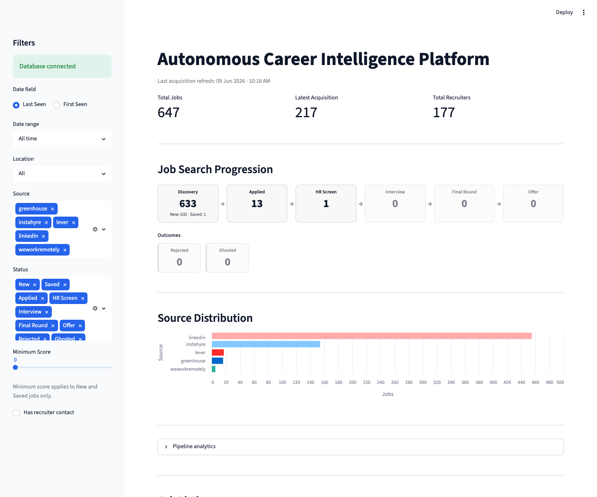
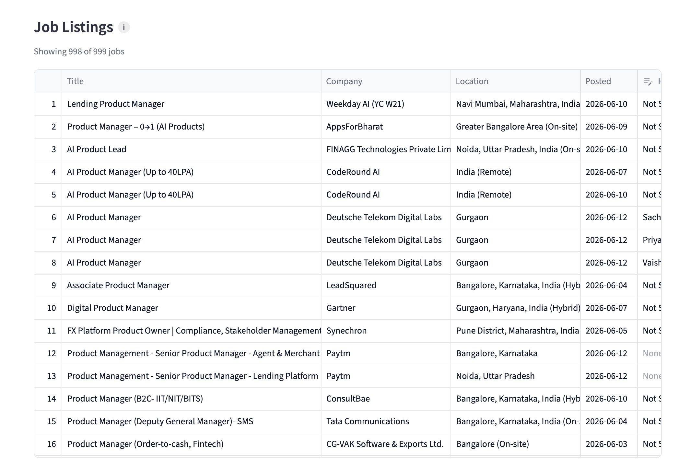
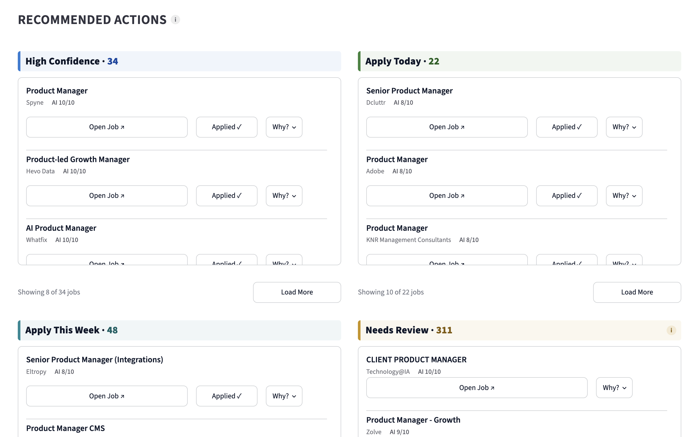
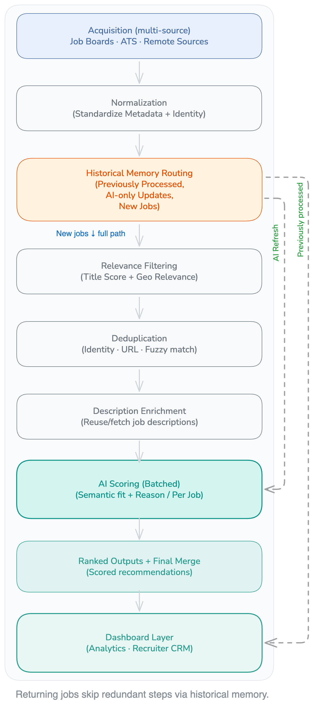
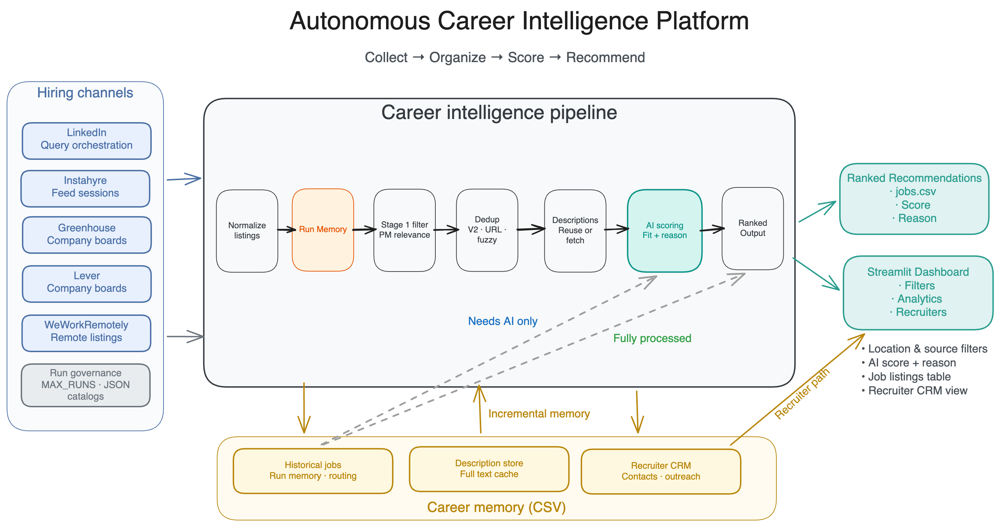
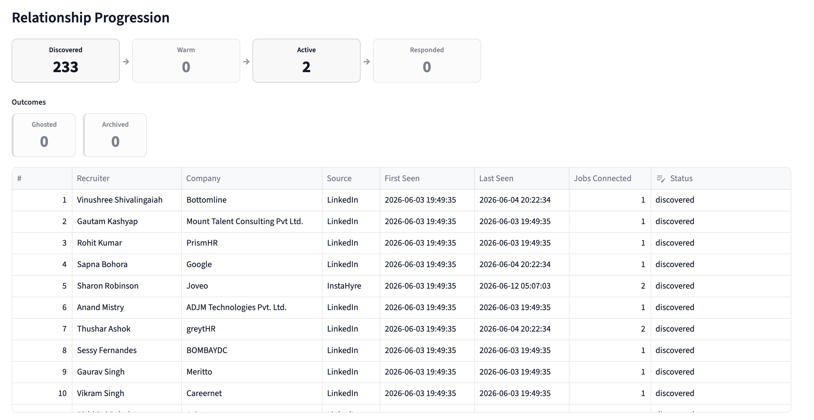

# Autonomous Career Intelligence Platform

An AI-powered job intelligence system that aggregates opportunities across multiple hiring channels, normalizes and deduplicates them, scores fit against a candidate profile, and surfaces actionable recommendations through operational dashboards and recruiter-aware memory.

Built for product-minded operators who want **signal over noise** - with transparent pipeline stages, explainable scoring, and production-grade observability.

---

## Documentation

Primary documentation index — start here.

| Doc | Purpose |
|-----|---------|
| [docs/PRODUCT_STATUS_SUMMARY.md](docs/PRODUCT_STATUS_SUMMARY.md) | **Status snapshot** — capability maturity, limitations, milestones summary; architecture diagrams in this README; live procedures in PRODUCTION_OPERATIONS |
| [docs/REPOSITORY_MAP.md](docs/REPOSITORY_MAP.md) | **Codebase navigation** — structure, data flow, subsystem map, entry points |
| [docs/SCHEDULER_SETUP.md](docs/SCHEDULER_SETUP.md) | **Canonical scheduling** — macOS launchd install, acquisition **09:00 / 21:00 IST**, lifecycle monitor **17:00 IST once daily**, logs, uninstall |
| [docs/PRODUCTION_OPERATIONS.md](docs/PRODUCTION_OPERATIONS.md) | **Canonical operator procedures** — daily workflow + pre-production reset |
| [docs/PROJECT_COMMAND_REFERENCE.md](docs/PROJECT_COMMAND_REFERENCE.md) §10b | Commands, flags, troubleshooting |
| [docs/SQLITE_IMPLEMENTATION_PLAN.md](docs/SQLITE_IMPLEMENTATION_PLAN.md) | D0–D8B migration history and rollback reference |
| [docs/SQLITE_PRODUCT_MEMORY_ARCHITECTURE.md](docs/SQLITE_PRODUCT_MEMORY_ARCHITECTURE.md) | SQLite data model and product memory design |
| [docs/PUBLIC_REPO.md](docs/PUBLIC_REPO.md) | Portfolio-safe publishing checklist |
| [config/profiles/README.md](config/profiles/README.md) | AI candidate profile editing |

---

## Why I Built This

Job searching today is not really a search problem - it is an **operations problem**.

The same role shows up on LinkedIn, on an ATS board, and on a niche marketplace. Titles look similar but responsibilities differ. A listing from last week may still be open, or it may already be stale. And every time you open a new tab, you lose context: who posted the role, whether you already saw it, and whether it is actually a fit for your level and domain.

I started with scraper scripts because I needed more reach than manual browsing. That helped me collect jobs, but it did not help me **decide**. I still had duplicates, noisy titles, no memory between runs, and no consistent way to explain why one role was worth my time and another was not.

So I rebuilt the approach as a **career intelligence platform**:

- **Orchestration** - Multiple sources run in a governed pipeline, not as one-off scripts.
- **Memory** - Historical state, stored descriptions, and recruiter metadata persist across runs so the system learns what it has already processed.
- **Layered filtering** - Fast relevance checks first, then deeper AI scoring only where it adds value.
- **Explainability** - Scores come with reasons tied to domain, responsibilities, and seniority - not just keyword matches.

The goal is not to automate "apply to everything." It is to create a **repeatable intelligence layer** that turns fragmented listings into a short, explainable list of opportunities worth human attention. That is the product mindset behind this repository: less tab chaos, more signal.

---

## Problem → Solution → Outcome

### The problem

Modern job search is not limited to one website. The same company may post on LinkedIn, an ATS board, and a niche marketplace. Titles compress real scope into a few words. Freshness, level, and domain fit are hard to judge from a card view alone. For a focused search (for example, product management in specific geographies), the volume is manageable in theory. In practice, it becomes an operations problem: too many tabs, too little memory, and too much repeated mental work.

### Why common approaches break down

**Manual tracking** (spreadsheets, Notion, starred tabs) works until volume and source count grow. You spend time re-entering jobs you already saw, reconciling duplicates by hand, and losing recruiter context between sessions.

**Single-source alerts** reduce noise in one channel but miss the rest of the market. They also rarely store full descriptions or scoring logic across runs.

**One-off scrapers** increase reach but do not create a **governed workflow**: no stable identity for the same role across URLs, no incremental routing for jobs already processed, and no explainable ranking for why a role surfaced today.

**Title-only filters** are fast but brittle. PM and adjacent roles often look identical in the title while differing sharply in responsibilities, seniority, and domain.

### Product and system design

This repository implements a **governed career intelligence pipeline**, not a dump of scraped rows.

**Fragmented ecosystem → unified ingestion.** Multiple hiring channels feed one normalization and identity layer, with per-source run caps so acquisition stays deliberate rather than unbounded.

**Noise and duplicates → layered filtering.** Stage-1 relevance removes obvious mismatches cheaply. Deduplication (V2 identity, exact URL, fuzzy title/company) runs before expensive description fetch and AI calls, so cost tracks signal.

**No run-to-run memory → incremental routing.** Historical state splits each job into brand new, needs AI only, or fully processed paths. Repeat runs do not re-filter and re-fetch everything from scratch.

**Shallow matching → AI scoring on full text.** Batched evaluation against a defined candidate profile produces a score and a short reason (domain, responsibilities, seniority), not a keyword hit.

**Listings without relationships → recruiter-aware memory.** Hiring contact metadata syncs into a CRM-style store so the system treats opportunities as part of an ongoing market map, not isolated URLs.

**Opaque batch jobs → operational visibility.** Run summaries, identity health, and batch progress are written for someone monitoring a live pipeline, not parsing ad hoc debug output.

### Outcomes and impact

For a recruiter or hiring manager reviewing this work, the useful signal is not scrape volume. It is whether the system produces a **smaller, explainable shortlist** with enough context to judge fit quickly: who is behind the role, why it ranked, and what changed since the last run.

- **Reduced repeated processing:** Historical routing sends fully processed jobs straight to merge, and "needs AI only" jobs skip Stage 1, dedup, and description fetch. Repeat runs spend effort on net-new work instead of replaying the full pipeline.
- **Lower unnecessary AI workload:** Stage-1 filtering and deduplication run before batch scoring. Description text is reused from the store when already captured, so model calls concentrate on jobs that cleared cheaper gates.
- **Faster identification of relevant PM roles:** Title and location rules remove obvious mismatches early. Semantic scoring then reads full descriptions, which matters when titles like "Product Manager" hide different levels and domains.
- **Cleaner deduplicated job intelligence:** V2 identity, exact URL matching, and fuzzy title/company checks reduce the same listing appearing under multiple links in the latest acquisition cohort.
- **Persistent recruiter context across runs:** Hiring manager and recruiter metadata (especially from Instahyre and LinkedIn) persist in SQLite recruiter memory (with optional CSV export), so sourcing sessions build on prior contact context instead of resetting each time.
- **Improved explainability of recommendations:** Each scored role carries a short `reason` tied to profile constraints, not only a numeric `ai_score`, making it easier to defend why a role is worth review or should be skipped.
- **Inspectable operations:** Stage summaries, identity health, and per-batch AI progress give concrete counts per run (accepted vs rejected, deduped, queued for scoring), which supports tuning sources and filters with evidence rather than intuition.

---

## Quick Start

You do not need to run code to understand what this project does. Think of it as three layers:

| Layer | What it does | What you see |
|-------|----------------|--------------|
| **Collect** | Gathers roles from hiring channels you configure | New jobs enter the system each run |
| **Organize** | Removes duplicates and applies relevance rules | A cleaner, de-duplicated set of roles |
| **Recommend** | AI scores fit against a defined candidate profile | Ranked opportunities with short explanations |

### In plain language

1. **Jobs come in** from places like LinkedIn and Instahyre (and optional company boards).
2. **The pipeline cleans and filters** them so you are not reviewing the same posting three times under different URLs.
3. **AI adds a second opinion** on fit - useful for PM-style roles where the title alone is misleading.

### If you are reviewing this as a recruiter or hiring manager

- Ask: *Does this person think in systems?* - The README sections on pipeline flow, memory, and recruiter CRM show intentional product design, not a single scraper.
- Ask: *Is the output actionable?* - Scored jobs include a **reason** field, not just a number.
- Ask: *Can they operate it?* - Run summaries are written for live monitoring (batch progress, pipeline totals), not raw debug dumps.

### If you want to see the product surface (technical setup required)

Someone with the project installed locally can:

1. Run the pipeline once to refresh recommendations.
2. Open the **Streamlit dashboard** to browse scored roles, filter the job table, review source distribution, and manage recruiter relationships — see [Dashboard](#dashboard).

Detailed install steps are in [Local Setup for Developers](#local-setup-for-developers) at the end of this README - intentionally separated so this section stays approachable.

### What you will not find in this Quick Start

- API keys, login sessions, or live job data (private/local by design).
- Guaranteed apply links or employer endorsements - always verify on the source site.

> **For engineers:** `python main.py` then `./scripts/run_dashboard.sh` - see [Local Setup for Developers](#local-setup-for-developers).

---

## Product Overview

This platform turns fragmented job listings into a **single career intelligence layer**:

| Problem | How the platform addresses it |
|--------|-------------------------------|
| Jobs scattered across LinkedIn, ATS boards, and niche marketplaces | Multi-source acquisition with per-source orchestration and run caps |
| Duplicate listings and unstable URLs | Dual identity system (legacy + V2) with layered deduplication |
| Shallow title-only filtering | Stage-1 rules plus semantic AI scoring on full descriptions |
| Lost context between runs | Historical memory, description store, and recruiter CRM |
| Hard-to-debug batch pipelines | Dashboard-style operational logging at each stage |

The system is designed as a **personal career copilot** that can be demonstrated to recruiters, hiring managers, and product/AI teams as a serious orchestration product - not a one-off scraper script.

**Product memory:** SQLite (`data/ai_job_agent.db`) is the default source of truth under D8B; CSV files under `data/` are optional exports for backup and handoff.

> **Diagram:** See [System Architecture](#system-architecture) for the end-to-end platform overview.

---

## Key Features

- **Multi-channel acquisition** - LinkedIn (query-orchestrated), Instahyre (feed-driven + Interested sync), Greenhouse, Lever, WeWorkRemotely
- **Instahyre Interested sync** - Post-feed list-only harvest; Interested queue membership → `Applied` state; early SQLite persist (`not_required` for CRM stages) — [docs/PROJECT_COMMAND_REFERENCE.md §5](docs/PROJECT_COMMAND_REFERENCE.md#5-instahyre-specific-controls)
- **Configurable run governance** - Per-source `*_MAX_RUNS` environment gates (disable with `0`, cap with positive integers); `INSTAHYRE_MAX_RUNS=0` disables feeds **and** Interested sync
- **Incremental historical routing** - Brand-new vs needs-AI-only vs fully-processed vs **user-managed** (CRM stages skip AI via `not_required`)
- **User-managed pipeline** - `New`/`Saved` discovery stages; `Applied+` CRM workflow stages bypass AI evaluation — [`src/agent/pipeline_stages.py`](src/agent/pipeline_stages.py)
- **Stage-1 relevance filter** - Fast title/location scoring before expensive steps
- **Global deduplication** - V2 identity, exact URL, and fuzzy title/company matching
- **Description persistence** - Reuse stored job text; fetch only when missing
- **AI batch scoring** - Profile-aligned semantic evaluation with structured JSON reasons
- **Recruiter intelligence** - CRM sync from hiring manager / recruiter metadata (especially Instahyre)
- **Tier-2 metadata (Instahyre)** - Posted date and age from Schema.org JSON-LD on detail pages
- **Streamlit dashboard** - Job Search Progression (Discovery / Application / Outcomes), KPIs, source distribution, filterable job table, pipeline analytics expander, and recruiter CRM — see [Dashboard](#dashboard)
- **Operational observability** - Summarized logs for Stage-1, identity health, LinkedIn/Instahyre acquisition, and AI batches
- **Scheduled production acquisition** - Twice-daily local runs (**09:00 / 21:00 IST**) via launchd, file-locked wrappers, and post-run parity validation
- **Scheduled lifecycle monitor (Scheduler B)** - Once-daily listing availability checks (**17:00 IST**) via launchd; `listing_status` on jobs is the sole listing-availability model; dashboard via `./scripts/run_dashboard.sh`

---

## Dashboard

<p align="center">
  
</p>

The **Streamlit dashboard** is the operator UI for reviewing acquisition output: header KPIs (**Total Jobs**, **Latest Acquisition**, **Total Recruiters**), **Last Monitoring Refresh**, then **Operational Controls** (pause/resume acquisition and lifecycle schedulers; **Refresh AI Evaluations** with preset picker and subprocess trigger when `SQLITE_DASHBOARD_WRITE=1`), **Acquisition Health** (Scheduler A summary KPIs + run history), **Operational Monitor Health** (Scheduler B summary KPIs + run history), **AI Refresh Health** (latest completed manual re-score run: two-row KPIs — Health/Last Preset, then Jobs Scored/Last Run Duration/Last Run Cohort/Last Run Eligible/Batch Failures — plus run history without cap-skipped columns), **Recommended Actions** (four rule-based job queues on `dashboard_df` in a 2×2 Command Center; `listing_status=open` only), **Job Search Progression** stage cards (Discovery → Application → Outcomes), source distribution (human-readable source labels), a sidebar-filtered job listings table (Listing/Age columns; `open` and `closed` visible; `removed` hidden), collapsible pipeline analytics, recruiter relationship management, and **Outreach Intelligence V1–V1.3** (opportunity-centric outreach attempt log below CRM; V1.2 LinkedIn post ingestion, V1.3 Job Outreach split). Listing visibility is **always on** via `listing_status` (TD10). Dashboard metrics use the visibility cohort (`dashboard_df`); sidebar filters affect the job table only. **Canonical launch:** `./scripts/run_dashboard.sh` (loads repo `.env`). Architecture: [docs/PROJECT_COMMAND_REFERENCE.md §8](docs/PROJECT_COMMAND_REFERENCE.md#8-streamlit-dashboard), [docs/REPOSITORY_MAP.md §5](docs/REPOSITORY_MAP.md#5-data-flow).

<p align="center">
  
</p>

### Recommended Actions Command Center

Phase 3A.2 surfaces high-fit discovery jobs in four scrollable queue panels (waterfall assignment — each job in at most one queue): **High Confidence** (score ≥ 9, days 0–13), **Apply Today** (score 8, days 0–3), **Apply This Week** (score 8, days 4–13), and **Needs Review** (14+ days). Panels use a **2×2 grid** with per-queue display caps (8 / 10 / 12 / 10) and **Load More** (+25). Panel height is dynamic (max 360px) based on visible card count. Each card shows title, company, and AI score; **Open Job ↗** opens the posting URL; **Applied ✓** (Phase 3A.1) on High Confidence, Apply Today, and Apply This Week marks the job Applied; **Why?** opens a popover with the full AI rationale. Needs Review uses a help icon for queue guidance. Queues use `dashboard_df` only — sidebar filters do not change queue membership.

<p align="center">
  
</p>

---

## End-to-End Pipeline Flow

This diagram shows the governed workflow from multi-source job ingestion through filtering, enrichment, and AI scoring to ranked recommendations and the dashboard layer.

<p align="center">
  
</p>

**Typical routing:**

- **Brand new** → Stage 1 → dedup → descriptions → AI queue  
- **Needs AI only** → joins AI queue directly (skips repeat Stage 1 / dedup / fetch)  
- **User-managed historical** → fully processed + `not_required` (CRM stages; skip AI)  
- **Fully processed** → merged from historical memory without re-scoring  

**Instahyre two-phase:** feed acquisition (detail pages) → Interested sync (list-only, Applied state, early DB write, not in main AI pipeline).

---

## System Architecture



Diagram inventory (current vs deprecated assets): [docs/REPOSITORY_MAP.md §2.1](docs/REPOSITORY_MAP.md#21-diagram-assets).

The platform follows a single governed path from fragmented listings to actionable recommendations. **Multi-source ingestion** pulls roles from LinkedIn, Instahyre, Greenhouse, Lever, and WeWorkRemotely under per-source run controls. In production, **macOS launchd** triggers the pipeline on a fixed schedule ([docs/SCHEDULER_SETUP.md](docs/SCHEDULER_SETUP.md)) through file-locked wrappers and post-run parity validation. **SQLite product memory** (`data/ai_job_agent.db`) is the default store for jobs, evaluations, descriptions, and recruiter metadata. **Layered filtering** normalizes and routes each job through historical memory, fast Stage-1 relevance checks, and deduplication before expensive description fetch and AI work. **AI scoring** evaluates full job text in batches against a candidate profile, returning a fit score and a short, explainable reason. **Recruiter-aware memory** persists contact metadata so repeat runs stay incremental rather than starting from zero. **Operational dashboards** surface ranked outputs in Streamlit and summarized pipeline logs for live run monitoring.

---

## AI Scoring Pipeline

AI evaluation runs in **batches** (default batch size: 15) against the external candidate profile [`config/profiles/ai_candidate_profile.example.md`](config/profiles/ai_candidate_profile.example.md) (override: `AI_CANDIDATE_PROFILE_PATH`). Scoring rules and JSON format live in [`src/agent/ai_batch_scorer.py`](src/agent/ai_batch_scorer.py); see [config/profiles/README.md](config/profiles/README.md).

**What the model evaluates:**

- Domain fit (B2B SaaS, fintech, AI, etc.)
- Responsibility signals from description text (not title alone)
- Seniority alignment vs profile constraints
- Explicit rejection of staff/principal/director-style roles when configured

**Outputs per job:**

| Field | Meaning |
|-------|---------|
| `ai_score` | 0-10 fit score |
| `reason` | Short explanation referencing domain, responsibilities, seniority |

**Operational logging:**

- One session start banner with candidate count and batch plan  
- Per-batch completion lines (jobs scored, elapsed time)  
- One session completion summary  

Enable verbose OpenAI diagnostics with `DEBUG_AI=true`.

---

## Sample Ranked Recommendations

Recommendations are produced after layered relevance filtering and AI scoring against a defined candidate profile (domain, seniority, and responsibility fit). The examples below are anonymized outputs representative of historical pipeline runs.

<strong><span style="color:#0969da">Company names and identifiers have been anonymized for portfolio presentation.</span></strong>

| Company | Role | AI Score | AI Recommendation |
|---------|------|----------|-------------------|
| B2C AI subscription (Remote) | Product Manager | 9 | **Recommend.** Strong alignment with ownership-heavy B2C product work, AI-led growth, and experimentation. |
| Payments infrastructure (India) | Product Manager II | 7 | **Moderate fit.** Solid fintech scope and execution ownership. Review level and location before raising priority. |
| India payments platform | Product Growth Manager | 5 | **Conditional.** Relevant growth domain, but the JD is analytics- and SQL-heavy versus strategy-led PM work. Quick scan only. |
| Large cloud platform | Product Manager, GPU-as-a-Service | 2 | **Low relevance.** Infrastructure-focused GPU platform role with a senior technical bar. Outside target PM scope and seniority band. |

---

## Identity + Deduplication System

### Identity (V2)

Each job receives:

- **Legacy `JOB_KEY`** - `normalized_title::normalized_company` (stable routing / historical compatibility)
- **`JOB_KEY_V2`** - Source-aware opaque ID (LinkedIn ID, Greenhouse/Lever/Instahyre IDs, canonical URL, or hash fallback)
- **`identity_source`** - Tier tag for observability (strong ID vs weak URL/hash)

Production logs include **Job Identity Health** and **Production Identity Health** summaries (tier mix, collisions, unresolved rates). Deep funnel tables are available with `DEBUG_IDENTITY=true`.

### Deduplication (ordered)

1. **V2 match** - Same `JOB_KEY_V2` → duplicate  
2. **Exact link** - Identical application URL  
3. **Fuzzy match** - High title + company similarity with seniority guardrails  

Dedup runs **after** Stage-1 and **before** description fetch to avoid redundant browser/API work.

---

## Recruiter Intelligence Layer

When sources expose hiring contact metadata (**Instahyre** detail pages, **LinkedIn** job pages), the pipeline:

- Extracts recruiter name, title, company, and profile link  
- **LinkedIn:** primary BEM selector + flagship3 poster-section fallback for `hiring_manager` and relative `time_posted` (see [PROJECT_COMMAND_REFERENCE §8](docs/PROJECT_COMMAND_REFERENCE.md) for probe/backfill tooling)  
- Maps `hiring_manager` for downstream ranking and CRM  
- Persists recruiter records in **SQLite** (`recruiters` table) with mutation-aware updates; optional **`recruiter_crm.csv`** export when enabled  
- **Forward HM protection:** re-scrapes that return sentinel HM (`Not Specified` / blank) do not overwrite a real stored name (dual-write merge)

This supports a **relationship-centric** view of the job market - not just listings, but who is behind them.

The dashboard **Recruiter Relationship Manager** shows **Total Recruiters**, a **Recruiter Relationship Progression** workflow (stage cards by `recruiter_stage`: discovered → warm → active → responded, plus ghosted/archived outcomes), and an editable CRM table. Metrics use CRM workflow stages, not acquisition sighting flags.

<p align="center">
  
</p>

### Outreach Intelligence V1–V1.3

**Outreach Intelligence** (below Recruiter Relationship Management) is an opportunity-centric outreach attempt log — not a CRM. KPIs: Total Outreach Records, Active Outreach, Follow-Ups Due Today, Overdue Follow-Ups. Supports manual + job-linked creation (optional prefill from Job Listings). **V1.1** adds required hiring signal type (9 types incl. `job_listing`) and optional signal URL on new records. **V1.2** adds LinkedIn post Fetch Details + AI prefill in Add Outreach. **V1.3** adds Job Outreach split with DB-driven prefill (`outreach_type`). Edit status, signal, and follow-up dates in the outreach table when `SQLITE_DASHBOARD_WRITE=1`; read-only KPIs, filters, and table when writes are off but `SQLITE_READ=1`. No write-back to recruiter stages or job pipeline. See [docs/PROJECT_COMMAND_REFERENCE.md §8](docs/PROJECT_COMMAND_REFERENCE.md#outreach-intelligence-v1).

### Job freshness metadata (data layer)

At acquisition, relative `time_posted` is normalized to ISO `posted_at_date` / `age_days` in SQLite (`posted_date_derive` + dual-write COALESCE). Optional one-time backfills: anchor derive and Playwright re-scrape ([PROJECT_COMMAND_REFERENCE §8](docs/PROJECT_COMMAND_REFERENCE.md)). **Dashboard Posted column still uses `last_seen`** — display phase is future.

### Inactive job flag

Listing availability in the dashboard and Recommended Actions is driven by **`listing_status`** on jobs (`open`, `closed`, `removed`, etc.), updated by the lifecycle monitor. LinkedIn user-applied detection during monitor runs can auto-promote discovery-stage jobs to **Applied** and set **`monitor_exempt`**. The legacy post-acquisition inactive sweep (`currently_active` on observations) was retired in Task 4 (TD10).

### Data repair tooling (HM)

One-time operator scripts for LinkedIn HM gaps: manifest backfill for sentinel HM without recruiter links (Task C), overwrite repair when a link exists (Task E). Commands and cohort guards: [PROJECT_COMMAND_REFERENCE §8](docs/PROJECT_COMMAND_REFERENCE.md) and §10b.

### Manual Hiring Manager Capture (Phase 3B)

Hiring Managers can be edited directly from the **Job Listings** dashboard. When SQLite dashboard writes are enabled (`SQLITE_DASHBOARD_WRITE=1`), updating the Hiring Manager automatically:

- updates the job record (`jobs.hiring_manager` — current display for that row)
- creates or updates the recruiter in **Recruiter CRM** (`recruiters` upsert by normalized name)
- creates an **append-only** recruiter–job relationship (`recruiter_job_links`)
- **preserves historical recruiter associations** (prior links are never removed when HM changes)

Job Listings shows the current Hiring Manager only; Recruiter CRM retains all historical recruiter–job links for the role.

---

## Operational Logging + Observability

Logging is designed for **live run monitoring**, not debug dumps.

| Stage | Production output | Debug flag |
|-------|-------------------|------------|
| Stage-1 | Aggregate summary (counts, score buckets, by source) | `DEBUG_STAGE1=true` |
| LinkedIn | Acquisition start/complete, query metrics, HM extraction (primary + flagship3), `time_posted` | `DEBUG_LINKEDIN=true` |
| Instahyre | Feed/session summaries, compact per-job lines | `DEBUG_INSTAHYRE=true` |
| Identity | Job + production identity health dashboards | `DEBUG_IDENTITY=true` |
| AI scoring | Batch progress + completion totals | `DEBUG_AI=true` |
| Pipeline | Flow-style pipeline summary with ↓ transitions | - |

Runtime artifacts (`logs/`, `__pycache__/`, query state files) are gitignored and not part of the repository.

---

## Current Tech Stack

| Category | Technology |
|----------|------------|
| Language | Python 3.12+ |
| Orchestration | `main.py` batch pipeline |
| Product memory | SQLite (`data/ai_job_agent.db`), Alembic migrations |
| Browser automation | Playwright (LinkedIn, Instahyre) |
| AI | OpenAI API (`gpt-4o-mini` via Responses API) |
| Data | pandas; CSV as export/backup (not primary memory under D8B) |
| Fuzzy matching | RapidFuzz |
| Dashboard | Streamlit, Altair (reads SQLite views by default) |
| Config | JSON catalogs + [`config/profiles/`](config/profiles/) candidate profile |

---

## Example Workflow

1. **Configure environment** - API keys and optional source run caps (see [Local Setup for Developers](#local-setup-for-developers)).  
2. **Run acquisition** - `python main.py` (SQLite on by default; no `SQLITE_*` exports).  
3. **Review terminal summary** - Pipeline summary, identity health, AI batch results.  
4. **Validate** - `python scripts/validate_sqlite_parity.py --mode production --fail-on-error` (recommended).  
5. **Open dashboard** - `./scripts/run_dashboard.sh` (loads `.env`). Reads `historical_jobs_view` + listing-status visibility layer; export cohort via `current_jobs_view`.  
6. **Iterate** - Adjust query catalogs, feeds, or [profile markdown](config/profiles/ai_candidate_profile.example.md); re-run incrementally.  

**Canonical daily and reset procedures:** [docs/PRODUCTION_OPERATIONS.md](docs/PRODUCTION_OPERATIONS.md). System overview: [docs/PRODUCT_STATUS_SUMMARY.md](docs/PRODUCT_STATUS_SUMMARY.md).

**Example: LinkedIn-only validation run**

```bash
INSTAHYRE_MAX_RUNS=0 WEWORKREMOTELY_MAX_RUNS=0 LEVER_MAX_RUNS=0 GREENHOUSE_MAX_RUNS=0 \
LINKEDIN_MAX_RUNS=1 python main.py
```

**Example: Instahyre default (2 feeds + Interested sync)**

```bash
python main.py
# Instahyre feeds + Interested sync run unless INSTAHYRE_MAX_RUNS=0
```

---

## Future Roadmap

See docs/PRODUCT_STATUS_SUMMARY.md for canonical phase statuses and recommended priorities. **Lifecycle Monitor Tasks 1–4 + OHM complete.** Current product state: [docs/PRODUCT_STATUS_SUMMARY.md](docs/PRODUCT_STATUS_SUMMARY.md) §1 and §8–§9.

---

## Repository Structure

```
ai-job-agent/
├── main.py                 # Pipeline entrypoint shim (runs src/agent/main.py)
├── requirements.txt
├── pyproject.toml          # Package metadata (requires-python >=3.12)
├── src/
│   ├── agent/              # Pipeline core (normalize, dedup, AI, persistence, pipeline_stages)
│   ├── db/                 # SQLite product memory (models, dual-write, read views, recruiter_enrichment)
│   └── paths.py            # Central path resolution (data/, config/, logs/)
├── dashboard/
│   ├── app.py              # Streamlit dashboard
│   ├── loaders.py          # SQLite/CSV data loaders
│   ├── data_flow.py        # dashboard_df vs filtered_df cohorts
│   ├── recommended_actions.py       # Phase 3A job action queues
│   ├── recommended_actions_ui.py    # Recommended Actions dashboard UI
│   ├── recommended_actions_config.py
│   ├── display_text.py     # Why? popover and rationale formatting
│   ├── source_display.py   # Human-readable source labels (sidebar, chart, table, CRM)
│   ├── ui_help.py          # Info-icon tooltips (Needs Review, Job Listings)
│   ├── job_editor.py       # Job Listings dirty detection
│   ├── funnel.py           # Job Search Progression counts
│   ├── funnel_workflow.py  # Progression stage-card UI
│   ├── recruiter_stages.py # CRM workflow stage constants
│   ├── recruiter_funnel.py # Recruiter progression counts
│   ├── recruiter_workflow.py  # Recruiter progression stage-card UI
│   ├── outreach_status.py  # Outreach status/channel constants
│   ├── outreach_metrics.py # Outreach KPI computation
│   ├── outreach_prefill.py # Job-linked outreach prefill
│   ├── outreach_ui.py      # Outreach Intelligence V1 dashboard section
│   ├── operator_controls_ui.py  # Operational Controls (schedulers + AI refresh trigger)
│   ├── acquisition_ui.py   # Acquisition Health section
│   ├── monitor_ui.py       # Operational Monitor Health section
│   └── ai_refresh_ui.py    # AI Refresh Health section
├── scraper/                # Multi-source acquisition
├── alembic/                # Database schema migrations
├── tests/                  # Unit tests
├── config/                 # Query/feed catalogs + profiles/
├── data/                   # SQLite DB, runtime CSV + auth (gitignored)
├── diagrams/               # Architecture, pipeline, and dashboard visuals
├── scripts/                # Archive, reset, validation, scheduling, backfill/repair/sweep/probe ops
│   └── scheduling/         # launchd wrappers + plist templates (production)
├── archive/                # Point-in-time state snapshots
└── docs/                   # PRODUCT_STATUS_SUMMARY, REPOSITORY_MAP, PRODUCTION_OPERATIONS, PCR, SQLite plans
```

**Live runtime files (local only, gitignored under `data/` and `logs/`):**  
`ai_job_agent.db`, `jobs.csv`, `historical_jobs.csv`, `job_descriptions.csv`, `recruiter_crm.csv`, `linkedin_auth.json`, `instahyre_auth.json`, `.linkedin_query_state.json`, `logs/` (including `logs/scheduled/` for automated runs)

---

## Local Setup for Developers

Skip this section if you only need a product walkthrough - see [Quick Start](#quick-start).

### Prerequisites

- Python 3.12+ recommended  
- Playwright browsers installed (`playwright install`)  
- OpenAI API key  

### 1. Clone and virtual environment

```bash
git clone <repository-url>
cd ai-job-agent
python -m venv venv
source venv/bin/activate   # Windows: venv\Scripts\activate
```

### 2. Dependencies

```bash
pip install -r requirements.txt
playwright install chromium
```

### 3. Secrets (never commit)

| File / variable | Purpose |
|----------------|---------|
| `OPENAI_API_KEY` | AI batch scoring |
| `data/linkedin_auth.json` | LinkedIn session (created via scraper login flow) |
| `data/instahyre_auth.json` | Instahyre session (Playwright storage state) |

### 4. Source run controls

| Variable | Default behavior |
|----------|------------------|
| `LINKEDIN_MAX_RUNS` | `5` (orchestrated queries); `0` disables |
| `INSTAHYRE_MAX_RUNS` | `2` feeds; `0` disables |
| `GREENHOUSE_MAX_RUNS` | `1`; `0` disables |
| `LEVER_MAX_RUNS` | `1`; `0` disables |
| `WEWORKREMOTELY_MAX_RUNS` | `1`; `0` disables |

### 5. Run pipeline and dashboard

```bash
export OPENAI_API_KEY="your-key-here"
python main.py
./scripts/run_dashboard.sh
```

### 6. Production scheduling (macOS)

Automated acquisition (**09:00 and 21:00 IST**) and lifecycle monitor (**17:00 IST once daily**): [docs/SCHEDULER_SETUP.md](docs/SCHEDULER_SETUP.md). Task 3 activation record: docs/SCHEDULER_SETUP.md. Task 4 cutover record (complete): docs/PRODUCT_STATUS_SUMMARY.md. Requires repo `.env` with `OPENAI_API_KEY` and a logged-in macOS session for Playwright auth.

### 7. Optional debug modes

```bash
DEBUG_STAGE1=true DEBUG_LINKEDIN=true DEBUG_INSTAHYRE=true \
DEBUG_IDENTITY=true DEBUG_AI=true python main.py
```

### Utility scripts

- `scripts/reset_state.sh` - Reset runtime state (SQLite + CSV templates per bootstrap profile)  
- `scripts/archive_state.sh` - Snapshot current state to `archive/`  
- `scripts/validate_bootstrap.py` - Validate schema after reset  

### SQLite product memory (default on, D8B)

SQLite (`data/ai_job_agent.db`) is the **default source of truth** for product memory. Acquisition, dashboard, and CRM read/write SQLite by default; CSV files are optional exports for backup and recovery.

```bash
# Normal acquisition (SQLite enabled by default)
python main.py
python scripts/validate_sqlite_parity.py --mode production --fail-on-error

# Backup / handoff + SOT validator (export first when write-primary skips CSV mirrors)
python scripts/export_csv_memory.py --all
python scripts/validate_sqlite_parity.py --mode source-of-truth --fail-on-error

# Recovery from archive
python scripts/import_csv_memory.py
python scripts/validate_sqlite_parity.py --mode import

# Emergency CSV-only rollback
SQLITE_ENABLED=0 python main.py
```

**Full command reference, PASS/WARN/FAIL semantics, and recovery workflows:** [docs/PROJECT_COMMAND_REFERENCE.md §10b](docs/PROJECT_COMMAND_REFERENCE.md#sqlite-product-memory-source-of-truth) (canonical).

Design background: [docs/SQLITE_IMPLEMENTATION_PLAN.md](docs/SQLITE_IMPLEMENTATION_PLAN.md), [docs/SQLITE_PRODUCT_MEMORY_ARCHITECTURE.md](docs/SQLITE_PRODUCT_MEMORY_ARCHITECTURE.md).

---

## Disclaimer - Showcase vs Private Operation

This repository is intended as a **professional showcase** of product thinking, pipeline design, and operational maturity. It reflects a real autonomous career intelligence implementation, with the following boundaries:

- **Credentials and live data are not included** - Auth JSON, CSV outputs, and logs stay local under `data/` (gitignored). See [docs/PUBLIC_REPO.md](docs/PUBLIC_REPO.md) before publishing.  
- **Candidate profile:** `config/profiles/ai_candidate_profile.example.md` (override with `AI_CANDIDATE_PROFILE_PATH`)  
- **Run caps** may be tuned for validation; adjust `*_MAX_RUNS` for production economics.  
- **Scraping** depends on third-party site behavior; respect terms of service and rate limits.  
- **AI scores are advisory** - Not hiring decisions; always verify listings on source sites.  

For interview or portfolio context: emphasize **orchestration**, **incremental memory**, **explainable AI**, and **operator-grade logging** - not raw scrape volume.

---

## License

Private / portfolio use unless otherwise specified by the repository owner.
