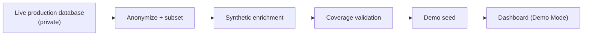

# Demo Mode

Demo Mode is how this product is actually experienced from this repository — a **hosted, live** sandbox, not a local install. This document explains what it is and how it's built; it does not ship the implementation.

**Live Demo:** `<LIVE_DEMO_URL>` — deployed from the private production repository.

## What Demo Mode is

| Mode | Database | Purpose |
|------|----------|---------|
| **Live** | Private production database | Real acquisition runs, real recruiter/outreach data |
| **Demo** | Anonymized seed database | Curated sandbox for portfolio/recruiter review |

Demo is **not** a stripped-down UI. It's the same dashboard surface — Recommended Actions, listings, CRM, outreach, Company Discovery, health sections — backed by a seed database purpose-built for portfolio presentation, with representative (not real) companies, roles, and outreach history.

## Sandbox architecture (conceptual)

The seed is produced from a real-shaped dataset, then anonymized, then enriched with synthetic records so every dashboard section (queues, CRM stages, outreach signals, discovery, health history) has representative coverage rather than sparse or empty states. A coverage-validation step checks presence across those categories before a seed is considered shippable — this is a deliberate, tested step, not an afterthought.

## Demo Policy

Every automation trigger, external API call, and CSV export path is gated through a single policy module rather than scattered `if demo` checks in feature code. A trimmed, standalone excerpt of that policy is kept in this repository: [`showcase/demo_policy_example.py`](../showcase/demo_policy_example.py).

**Denied in Demo:** acquisition/lifecycle/AI refresh/discovery runs, scheduler pause/resume, outreach "Fetch Details" / AI regenerate (anything hitting an external system), live CSV exports.

**Allowed in Demo:** job / CRM / outreach table edits, Recommended Actions interaction, Company Discovery approvals — all against sandbox data only.

## UI chrome

- A compact **Demo Mode** badge is shown when Demo is active.
- Amber help icons sit directly beside disabled external actions (e.g. "Fetch Details") with a tooltip explaining the sandbox limit — see [`showcase/ui_pattern_demo.py`](../showcase/ui_pattern_demo.py) for a runnable excerpt of that exact component.

## Public vs Live differences

| Aspect | Live (private operator) | Demo (this hosted sandbox) |
|--------|--------------------------|------------------------------|
| Data source | Real acquisition runs | Curated anonymized seed |
| External APIs | Enabled when configured | Gated by Demo Policy |
| Candidate profile | Private operator profile | Example profile ([`config/profiles/ai_candidate_profile.example.md`](../config/profiles/ai_candidate_profile.example.md)) |
| Writes | Persist to production database | Persist to an ephemeral sandbox copy |

See [ABOUT_THIS_REPO.md](./ABOUT_THIS_REPO.md) for why the acquisition, scoring, and automation implementations that power the Live side are not published here.
