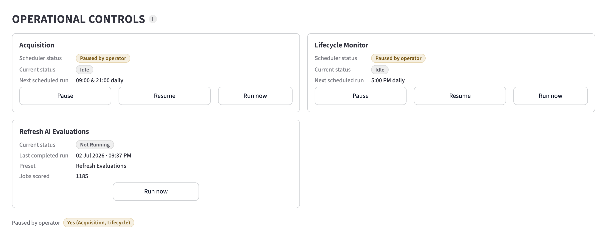
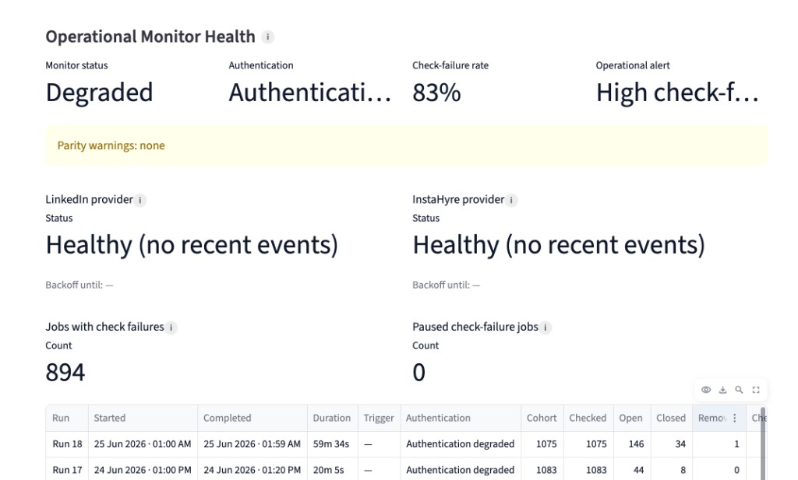
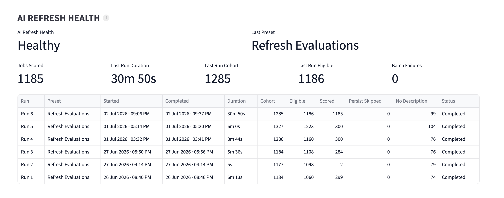
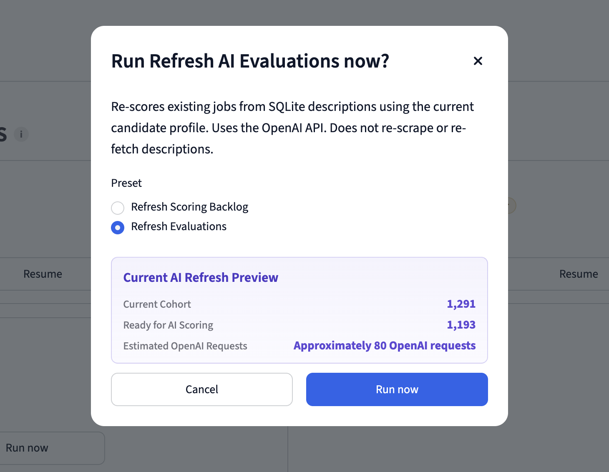

# Project Command Reference

PM-friendly cheat sheet for running, debugging, and operating **ai-job-agent**.  
All commands assume you are in the **repository root** unless noted otherwise.

**Runtime data lives in:** `data/` — primary store `data/ai_job_agent.db` (SQLite SOT, D8B); optional CSV exports; auth JSON and LinkedIn query state files (never in DB).  
**Config catalogs live in:** `config/` (no secrets)

SQLite flags and rituals: **§10b** (canonical). Step-by-step operator procedures: [PRODUCTION_OPERATIONS.md](./PRODUCTION_OPERATIONS.md).

---

## Quick safety labels

| Label | Meaning |
|-------|---------|
| **Safe** | Read-only or normal daily use |
| **Lightweight** | Fast check; limited scraping or no browser |
| **Heavy** | Full scrape + AI; costs time and API credits |
| **Destructive** | Erases or overwrites live state |

---

## 1. Environment setup

| Command | What it does | When to use | Safety |
|---------|--------------|-------------|--------|
| `python -m venv venv` | Creates a local Python environment | First-time setup | Safe |
| `source venv/bin/activate` | Activates venv (macOS/Linux) | Every new terminal session | Safe |
| `venv\Scripts\activate` | Activates venv (Windows) | Every new terminal session | Safe |
| `pip install -r requirements.txt` | Installs dependencies **and** editable package (`-e .`) | After clone or dependency changes | Safe |
| `pip install -e .` | Installs project so `paths`, `agent` import from anywhere | If Streamlit shows `No module named 'paths'` | Safe |
| `playwright install chromium` | Downloads browser for LinkedIn/Instahyre scrapers | Once per machine/venv | Safe |

### Required secret (pipeline AI scoring)

| Variable / file | What it does | When to use | Safety |
|-----------------|--------------|-------------|--------|
| `export OPENAI_API_KEY="..."` | Powers AI batch scoring | Before any run that reaches AI stage | Safe (keep private) |
| `data/linkedin_auth.json` | Saved LinkedIn browser session | Created by LinkedIn scraper login flow | Safe locally; never commit |
| `data/instahyre_auth.json` | Saved Instahyre browser session | Created by Instahyre scraper login flow | Safe locally; never commit |

### Optional data location override

| Variable | Default | What it does | When to use | Safety |
|----------|---------|--------------|-------------|--------|
| `AI_JOB_AGENT_DATA_DIR` | `<repo>/data` | Points all CSV/auth paths to a custom folder | Multiple clones, external disk | Safe |

---

## 2. Main pipeline runs

Entry point is always:

```bash
python main.py
```

Run from repo root with venv active.

| Command pattern | What it does | When to use | Safety |
|-----------------|--------------|-------------|--------|
| `python main.py` | Full pipeline: scrape → filter → dedup → descriptions → AI → export | Normal daily refresh | **Heavy** |
| `export OPENAI_API_KEY="..." && python main.py` | Same, with AI enabled | Production-style run | **Heavy** |
| `LINKEDIN_MAX_RUNS=0 INSTAHYRE_MAX_RUNS=1 python main.py` | Skip LinkedIn; run Instahyre (+ other sources per their defaults) | Instahyre-focused validation | Heavy |
| `LINKEDIN_MAX_RUNS=0 INSTAHYRE_MAX_RUNS=0 GREENHOUSE_MAX_RUNS=0 LEVER_MAX_RUNS=0 WEWORKREMOTELY_MAX_RUNS=0 python main.py` | Skips all acquisition (downstream stages still run on empty/new input) | Fast import/path smoke test only | Lightweight |
| `INSTAHYRE_MAX_RUNS=0 WEWORKREMOTELY_MAX_RUNS=0 LEVER_MAX_RUNS=0 GREENHOUSE_MAX_RUNS=0 LINKEDIN_MAX_RUNS=1 python main.py` | LinkedIn-only acquisition test | LinkedIn orchestration validation | Heavy |
| `LINKEDIN_MAX_RUNS=0 INSTAHYRE_MAX_RUNS=1 GREENHOUSE_MAX_RUNS=0 LEVER_MAX_RUNS=0 WEWORKREMOTELY_MAX_RUNS=0 python main.py` | Instahyre-only (no GH/Lever/WWR/LinkedIn) | Targeted Instahyre run | Heavy |

On startup, the pipeline may print migrated files if old root-level CSVs are moved into `data/`.

---

## 3. Source throttling (`*_MAX_RUNS`)

Controlled in `scraper/acquisition_gate.py` and `src/agent/main.py`.

| Variable | Default if unset | `0` | Positive number `N` | Invalid value |
|----------|------------------|-----|------------------------|---------------|
| `LINKEDIN_MAX_RUNS` | 5 queries | Disables LinkedIn | Caps orchestrated queries to N | Falls back to default |
| `INSTAHYRE_MAX_RUNS` | 2 feeds | Disables Instahyre **feed acquisition and Interested sync** | Caps feeds to N; when non-zero, also runs post-feed Interested sync (see §5) | Falls back to default |
| `GREENHOUSE_MAX_RUNS` | 1 run | Disables Greenhouse | Caps to N | Falls back to default |
| `LEVER_MAX_RUNS` | 1 run | Disables Lever | Caps to N | Falls back to default |
| `WEWORKREMOTELY_MAX_RUNS` | 1 run | Disables WeWorkRemotely | Caps to N | Falls back to default |

**Tip:** Set any source to `0` to skip it entirely. Leave unset to use the default cap.

---

## 4. LinkedIn-specific controls

| Variable | Default | What it does | When to use | Safety |
|----------|---------|--------------|-------------|--------|
| `LINKEDIN_QUERY_IDS` | (all eligible) | Comma-separated query IDs from `config/linkedin_queries.json` | Run only specific searches | Heavy |
| `LINKEDIN_LEGACY_SINGLE_QUERY=1` | off | Uses old single-URL scrape instead of orchestrator | Legacy/debug comparison | Heavy |
| `LINKEDIN_PRIORITY_ANCHOR` | on (config) | Set to `0`/`false`/`off` to skip priority anchor query | Narrow session behavior | Heavy |
| `LINKEDIN_PRIORITY_ANCHOR_ID` | from config | Forces anchor query ID | Debug anchor selection | Heavy |
| `LINKEDIN_MAX_NEXT_PAGES` | 5 | Max pagination steps per search | Limit LinkedIn volume | Heavy |
| `LINKEDIN_MAX_SHOW_MORE_CLICKS` | 3 | Max "show more" expansions | Limit list growth | Heavy |
| `LINKEDIN_SHOW_MORE_NO_GROWTH_STOP` | 2 | Stop after N no-growth show-more attempts | Stability tuning | Heavy |
| `LINKEDIN_RESET_ABORT_THRESHOLD` | 2 | Abort after repeated list resets | Stability tuning | Heavy |
| `LINKEDIN_PLAYWRIGHT_TRACE=1` | off | Records Playwright trace zip | Deep LinkedIn debugging | Heavy |
| `LINKEDIN_PLAYWRIGHT_TRACE_PATH` | `linkedin_playwright_trace.zip` | Output path for trace | With trace enabled | Heavy |
| `LINKEDIN_QUALIFICATION_LANDING_URL` | unset (navigation mode) | Emergency override: direct `goto` to a full copied How You Fit URL (bypasses in-browser navigation) | One-off debugging only | Heavy |
| `LINKEDIN_BROAD_PM_LANDING_URL` | from `config/linkedin_queries.json` | Overrides `broad_pm_easy_apply_7d` search-results URL without editing JSON | Refresh broad PM Easy Apply feed URL | Heavy |
| `LINKEDIN_PRIORITY_FOLLOWUP` | on (config) | Set to `0`/`false`/`off` to skip priority follow-up query after anchor | Single-query anchor-only sessions | Heavy |

LinkedIn scraper opens a **visible browser** (`headless=False`) for login/session use.

### Priority anchor: Top Applicant / How You Fit

The default priority anchor (`top_applicants_anchor`) uses `url_mode: qualification_landing` with **in-browser navigation** from a stable entry (`https://www.linkedin.com/jobs/`) to the personalized How You Fit feed — not the old `f_JIYN` low-applicant search approximation.

Navigation is configured under `navigation` in [`config/linkedin_queries.json`](../config/linkedin_queries.json) (`entry_url`, `keywords`, `geo_id`). The scraper tries a job-ID-stripped qualification URL, then UI clicks (Top applicant / How you fit) if needed. No periodic `landing_url` refresh is required.

**Emergency override only:** set `LINKEDIN_QUALIFICATION_LANDING_URL` to a full copied browser URL to bypass navigation (legacy direct `goto`). Production scheduled runs **`unset`** this variable — see [SCHEDULER_SETUP.md](./SCHEDULER_SETUP.md).

**LinkedIn-only anchor validation** (requires `data/linkedin_auth.json`):

```bash
INSTAHYRE_MAX_RUNS=0 GREENHOUSE_MAX_RUNS=0 LEVER_MAX_RUNS=0 WEWORKREMOTELY_MAX_RUNS=0 \
LINKEDIN_MAX_RUNS=1 DEBUG_LINKEDIN=1 python main.py
```

Expect: first query `Top Applicant / How You Fit PM`, `linkedin_filter_profile=qualification_landing`, jobs collected &gt; 0, `[LinkedInDiag]` logs show `qualification_nav_*`, final URL contains `search-results` or `showHowYouFit`.

### Priority follow-up: Broad PM Easy Apply 7d

Second query (`broad_pm_easy_apply_7d`) runs immediately after the anchor when `defaults.priority_followup.enabled` is true and the session has orchestrated budget (`LINKEDIN_MAX_RUNS` ≥ 2 with anchor counting toward max).

- **Query id:** `broad_pm_easy_apply_7d`
- **URL mode:** `search_results_landing` (PM keywords + Easy Apply + 7d via `f_TPR=r604800`, `f_AL=true`)
- **Metadata:** `linkedin_filter_profile=easy_apply_7d`

**Refresh the broad PM landing URL** from your LinkedIn job search (Easy Apply + Past week), then update `landing_url` on `broad_pm_easy_apply_7d` or set `LINKEDIN_BROAD_PM_LANDING_URL`.

**Two-query validation** (anchor + broad PM; requires `data/linkedin_auth.json`):

```bash
INSTAHYRE_MAX_RUNS=0 GREENHOUSE_MAX_RUNS=0 LEVER_MAX_RUNS=0 WEWORKREMOTELY_MAX_RUNS=0 \
LINKEDIN_MAX_RUNS=2 DEBUG_LINKEDIN=1 python main.py
```

Expect: `[PRIORITY_ANCHOR] top_applicants_anchor`, then `[PRIORITY_FOLLOWUP] broad_pm_easy_apply_7d`, both with jobs collected &gt; 0.

**Note:** `LINKEDIN_MAX_RUNS=1` runs only the anchor (by design). To test Query 2 alone: `LINKEDIN_MAX_RUNS=1 LINKEDIN_PRIORITY_ANCHOR=0 LINKEDIN_QUERY_IDS=broad_pm_easy_apply_7d`.

---

## 5. Instahyre-specific controls

| Variable | Default | What it does | When to use | Safety |
|----------|---------|--------------|-------------|--------|
| `INSTAHYRE_FEED_IDS` | (catalog order) | Comma-separated feed IDs from `config/instahyre_feeds.json` | Run specific feeds only | Heavy |
| `INSTAHYRE_QUERY_IDS` | — | Alias for `INSTAHYRE_FEED_IDS` if feed IDs unset | Same as above | Heavy |
| `INSTAHYRE_MAX_JOBS_PER_FEED` | **10000** (effectively uncapped) | Max detail extractions per feed; set lower to cap volume | Pagination runs typically need no override | Heavy |
| `INSTAHYRE_SCROLL_MAX_CYCLES` | **18** when unset (paginated feeds); 12 for legacy | Scroll fallback / legacy feeds only | Volume/stability tuning | Heavy |
| `INSTAHYRE_STABLE_ROUNDS` | **5** when unset (paginated feeds); 3 for legacy | Scroll fallback / legacy | DOM load tuning | Heavy |
| `INSTAHYRE_LIST_WAIT_MS` | **55000** when unset (paginated feeds); 45000 legacy | Wait for list (ms) | Slow network tuning | Heavy |
| `INSTAHYRE_POST_SCROLL_WAIT_MS` | **2000** when unset (paginated feeds); 1200 legacy | Post-scroll wait (scroll path) | Heavy |
| `INSTAHYRE_MATCHING_MIN_SCROLL_CYCLES` | 4 | Feed 1 scroll fallback only: minimum scroll cycles before stable exit | Avoid premature stop | Heavy |
| `INSTAHYRE_MATCHING_INITIAL_SETTLE_MS` | 1800 | Feed 1: pause after initial list wait | List hydration | Heavy |
| `INSTAHYRE_MAX_PAGES` | **5** (Feed 1) | Feed 1 pagination: max list pages to traverse | Cap pagination depth | Heavy |
| `INSTAHYRE_PAGE_MIN_NEW_RATIO` | **0.15** (Feed 1) | Stop when a page adds fewer than this fraction of new job IDs | Saturation tuning | Heavy |
| `INSTAHYRE_PAGE_TRANSITION_WAIT_MS` | 10000 | Max wait for active page / first job change after Next click | Slow Angular pages | Heavy |
| `INSTAHYRE_PAGE_SETTLE_MS` | 1500 | Pause after a successful page transition before harvest | List hydration | Heavy |
| `INSTAHYRE_MATCHING_SCROLL_FALLBACK` | 0 | Set `1` to use legacy scroll discovery instead of pagination on Feed 1 | Scroll A/B or regression | Heavy |

Feed 1 (`matching_personalized`) and Feed 2 (`pm_curated_search` → `/search-jobs`) default to **pagination traversal** (harvest all pages, then detail extraction). Debug metrics: `pages_traversed`, `cards_per_page`, `cumulative_unique_job_ids`, `pagination_stop_reason`, `final_unique_instahyre_jobs`, `page_traversal_details`.

With `INSTAHYRE_MATCHING_SCROLL_FALLBACK=1`, Feed 1 uses the scroll strategy chain (`container_scroll` → … → `document_wheel_last_resort`). Metrics: `strategy_fallback_chains`, `ineffective_scroll_cycles`, `scroll_strategy_used`.

### Instahyre Interested Sync (code Phase B — not CSV importer Phase B)

When `INSTAHYRE_MAX_RUNS` is not `0`, after feed acquisition `main.py` runs **Instahyre Interested synchronization** in a separate try/except block. If feed acquisition fails, Interested sync may still run in the same Instahyre block. When `INSTAHYRE_MAX_RUNS=0`, the entire Instahyre block (feeds **and** Interested sync) is skipped.

**Business rule:** membership in Instahyre's Interested filter (`/candidate/opportunities/?matching=true&status=1`) means the job is **Applied** — stubs set `applied=True`; persist promotes `""` / `New` → `Applied` when incoming is applied.

**Harvest (list + lightweight detail enrichment):**
- Feed id `interested_sync` (code-only; **not** in `config/instahyre_feeds.json`).
- Paginated list harvest via `_collect_feed_opportunity_cards`, then **brief per-job detail opens** (on by default) for lightweight metadata only — no descriptions, no Stage-1, no OpenAI `batch_score_jobs`.
- Shares pagination env vars with feeds (`INSTAHYRE_MAX_PAGES`, `INSTAHYRE_PAGE_*`, etc.).
- Stubs are **not** appended to `all_jobs`; they bypass normalize → routing → Stage-1 → dedup → AI.

| Variable | Default | Purpose |
|----------|---------|---------|
| `INSTAHYRE_INTERESTED_DETAIL_ENRICH` | `1` | Set `0` to restore list-only Interested sync (no detail pages) |
| `INSTAHYRE_INTERESTED_DETAIL_SETTLE_MS` | `1200` | Post-goto wait on each Interested detail page (ms) |

**Enriched fields (detail + list-card tags):** hiring manager / recruiter name, posted date (`posted_at_date`, `age_days`), company, location, employment type, experience level, workplace type (from `ul.candidate-opp-keywords` tags).

**SQLite persist via Interested sync:** `title`, `company`, `location`, `hiring_manager`, `posted_at_date`, `age_days` (existing `jobs` columns). `employment_type`, `experience_level`, `workplace_type` are captured on the job dict only (no `jobs` column yet).

**Persist order** (`persist_instahyre_interested_sync` in `dual_write.py`):
1. `jobs` — list + enriched metadata (HM/posted merge rules apply on re-sync)
2. `user_job_state` — merge with stage protection (see below)
3. Dedicated early `acquisition_run` (`run_notes=instahyre_interested_sync`) + `acquisition_query_runs` + `job_observations` (`query_id=interested_sync`)
4. `ai_evaluations` — `_upsert_not_required_ai_evaluations_for_user_managed_jobs` (`ai_status=not_required`, `model=instahyre_interested_sync`); does not clobber existing `scored` or `not_required` rows

**Stage protection** (`_merge_user_job_state_payload`): preserves snapshot for `rejected`, `Rejected`, and stages in `{Saved, Applied, HR Screen, Interview, Final Round, Offer, Rejected, Ghosted}` unless promoting `New`/`""` with incoming `applied=True`. Observations still update `first_seen` / `last_seen` even when stage is protected.

**Export cohort:** Interested-only jobs appear in `historical_jobs_view` but **not** in `current_jobs_view` / `jobs.csv` (tied to end-of-pipeline dual-write, not the early sync run).

**Within-run routing:** jobs with user-managed `pipeline_stage` (e.g. `Applied` from Interested sync) that reappear in feed acquisition route to **fully_processed** and skip AI (`not_required`).

**Terminal log block:** `🟣 INSTAHYRE INTERESTED SYNC SUMMARY` — fields include cards harvested, **`detail_enrich attempted` / `detail enriched`**, DB jobs upserted, observations written, **`protected_count`**, **`not_required_evals_written`**, **`sync_run_id`**.

**Does not run:** Stage-1, OpenAI batch scoring, description fetch, recruiter CRM link extraction. **Does** persist `ai_evaluations` rows as `not_required` for user-managed CRM stages (not the same as running AI scoring).

**Isolated Interested sync validation:**

```bash
DEBUG_INSTAHYRE=true \
LINKEDIN_MAX_RUNS=0 GREENHOUSE_MAX_RUNS=0 LEVER_MAX_RUNS=0 WEWORKREMOTELY_MAX_RUNS=0 \
INSTAHYRE_MAX_RUNS=1 \
python main.py

python -m unittest \
  tests.test_instahyre_interested_sync \
  tests.test_instahyre_interested_enrichment \
  tests.test_instahyre_applied_status \
  tests.test_dual_write_applied_merge \
  tests.test_materialize_applied_merge \
  -v
```

Success indicators: `🟣 INSTAHYRE INTERESTED SYNC SUMMARY` in terminal; `observations written` > 0 when Interested list has cards; unit tests pass.

**Isolated Feed 1 pagination validation:**

```bash
DEBUG_INSTAHYRE=true \
LINKEDIN_MAX_RUNS=0 GREENHOUSE_MAX_RUNS=0 LEVER_MAX_RUNS=0 WEWORKREMOTELY_MAX_RUNS=0 \
INSTAHYRE_MAX_RUNS=1 INSTAHYRE_FEED_IDS=matching_personalized \
INSTAHYRE_MAX_PAGES=5 \
python main.py

python -m unittest tests.test_instahyre_discovery tests.test_historical_persistence -v
```

Success indicators: `traversal_mode=pagination`, `pages_traversed >= 2`, opportunity cards / unique IDs **> 30**, `pagination_stop_reason` in (`no_next`, `max_pages`, `saturation`) — not `transition_failed` on page 1.

**Isolated Feed 2 (search-jobs) validation:**

```bash
DEBUG_INSTAHYRE=true \
LINKEDIN_MAX_RUNS=0 GREENHOUSE_MAX_RUNS=0 LEVER_MAX_RUNS=0 WEWORKREMOTELY_MAX_RUNS=0 \
INSTAHYRE_MAX_RUNS=1 INSTAHYRE_FEED_IDS=pm_curated_search \
INSTAHYRE_MAX_PAGES=5 \
python main.py
```

Success indicators: `feed_id=pm_curated_search`, URL contains `/search-jobs`, `traversal_mode=pagination`, `pages_traversed >= 1`, detail extraction after pagination completes.

**Pagination DOM probe (read-only):**

```bash
python scripts/instahyre_dom_probe.py
```

---

## 6. Debug and logging flags

Truthy values for most debug flags: `1`, `true`, `yes`, `on` (case-insensitive).

| Variable | What it does | When to use | Safety |
|----------|--------------|-------------|--------|
| `DEBUG_STAGE1=true` | Logs each job through Stage 1 (title/location filter) | Understand rejections | Lightweight (verbose) |
| `DEBUG_LINKEDIN=true` | LinkedIn traversal diagnostics, session plan, pauses | LinkedIn scrape issues | Heavy + verbose |
| `LINKEDIN_VERBOSE_DIAG=true` | Same as `DEBUG_LINKEDIN` (legacy alias) | Same | Heavy + verbose |
| `DEBUG_INSTAHYRE=true` | Instahyre feed metrics, rejections, tracebacks | Instahyre scrape issues | Heavy + verbose |
| `INSTAHYRE_DEBUG_DOM=true` | Extra DOM debug (also if `DEBUG_INSTAHYRE`) | Instahyre page structure issues | Heavy + verbose |
| `DEBUG_IDENTITY=true` | Extra identity funnel + dedup hit details in production health | Identity/memory debugging | Lightweight (extra logs) |
| `DEBUG_AI=true` | OpenAI request/response debug, parse errors | AI scoring failures | Heavy (API calls) |

### Reading pipeline logs (standard run)

After identity routing, look for:

- `Historical lookup stats (routing)` — V2 hits vs legacy fallback during historical lookup
- `Intake (raw scraped jobs) unresolved identity` — unresolved tier mix on all scraped jobs
- `Brand-new description pass` / `Needs-AI-only cache hydration` — separate description pools (not one combined “reused” total)
- `AI scoring queue` — total AI candidates queued for scoring
- `Export composition (this session)` — fully_processed + AI-scored counts before final merge
- `PIPELINE METRICS` — stage funnel counts; `PIPELINE SUMMARY` — routing + AI only (points to METRICS)
- `Scope: intake-wide` / `Scope: export cohort only` — clarifies routing lookup vs export health V2 rates
- `PRODUCTION IDENTITY HEALTH` — export-cohort unresolved count and by-source breakdown

### Full debug run (from README)

```bash
DEBUG_STAGE1=true DEBUG_LINKEDIN=true DEBUG_INSTAHYRE=true \
DEBUG_IDENTITY=true DEBUG_AI=true python main.py
```

| Safety | **Heavy** — very noisy; use on small `*_MAX_RUNS` caps |

### Always-on vs gated logging

| Output | Gated? |
|--------|--------|
| Stage 1 summary (counts, buckets, by source) | Always on |
| Dedup progress + summary | Always on |
| Duplicate hit details (V2 / exact / fuzzy) | Always on when a duplicate is removed |
| AI batch progress (`Batch N Complete`) | Always on |
| Job Identity Health / Production Identity Health | Always on (summary) |
| Identity funnel tables | `DEBUG_IDENTITY=true` only |
| LinkedIn session plan | `DEBUG_LINKEDIN=true` only |

**Note:** There is **no** separate dedup debug flag. Dedup logging was improved to always show check steps and a clear "no duplicates" message.

---

## 7. Code-level tuning (not environment variables)

Most pipeline tuning lives in `src/agent/main.py` (code edit). Profile and AI batch size also support env overrides.

| Setting | Location | Default | What it does |
|---------|----------|---------|--------------|
| `BATCH_SIZE` | `agent/ai_runtime_config.py` | `20` | Jobs per OpenAI batch; override: `BATCH_SIZE=25 python main.py` |
| **AI candidate profile** | [`config/profiles/ai_candidate_profile.example.md`](../config/profiles/ai_candidate_profile.example.md) | Loaded by `load_candidate_profile()`; override: `AI_CANDIDATE_PROFILE_PATH` — see [config/profiles/README.md](../config/profiles/README.md) |

Scoring rules and JSON output format stay in [`src/agent/ai_batch_scorer.py`](../src/agent/ai_batch_scorer.py) (not in the profile file). Stage-1 filtering does **not** use the profile text.

| Variable | Default | What it does | When to use | Safety |
|----------|---------|--------------|-------------|--------|
| `HISTORICAL_V2_UPSERT` | `1` (on) | V2-assisted historical upsert when legacy key misses | Turn off only for legacy experiments | Safe |

---

## 8. Streamlit dashboard

| Command | What it does | When to use | Safety |
|---------|--------------|-------------|--------|
| `./scripts/run_dashboard.sh` | Loads repo `.env`, then starts Streamlit (D8B: SQLite read/write by default) | **Canonical** production / Task 3 dashboard launch | Safe |
| `./scripts/run_dashboard.sh --server.port 8502` | Same on custom port | Port conflict | Safe |
| `streamlit run dashboard/app.py` | Starts dashboard **without** loading `.env` | Dev only — use `./scripts/run_dashboard.sh` for production | Safe |

**Prerequisite:** `pip install -r requirements.txt` (includes editable install).

### Default path (D8B)

No `SQLITE_*` exports required when using the canonical launcher:

```bash
./scripts/run_dashboard.sh
```

**Listing visibility:** Job Listings show `open` and `closed` (all pipeline stages); `removed` hidden. Recommended Actions include only `listing_status=open`. Listing visibility is **always on** (TD10) — no `LISTING_STATUS_VISIBILITY_UI` flag.

### Dashboard section order

Rendered top-to-bottom in [`dashboard/app.py`](../dashboard/app.py) (after header KPIs and Job Search Progression / Source Distribution):

1. **Operational Controls** — scheduler pause/resume and Refresh AI Evaluations trigger
2. **Acquisition Health** — latest Scheduler A run KPIs + history
3. **Operational Monitor Health** — latest Scheduler B run KPIs + history
4. **AI Refresh Health** — latest manual re-score run KPIs + history
5. **Recommended Actions** — four-queue Command Center
6. **Job Listings** — sidebar-filtered table
7. **Recruiter Relationship Management** + progression
8. **Outreach Intelligence**

<p align="center">
  
</p>

### Operational Controls

[`dashboard/operator_controls_ui.py`](../dashboard/operator_controls_ui.py) — macOS launchd integration for acquisition and lifecycle schedulers; manual **Refresh AI Evaluations** subprocess trigger.

| Card | Shows | Actions (write gate on) |
|------|-------|-------------------------|
| **Acquisition** | Scheduler status, idle/running, next scheduled run | Pause · Resume · Run now |
| **Lifecycle Monitor** | Same + OHM re-enable ladder when gated | Pause · Resume · Run now · Record validation ladder passed · Approve lifecycle re-enable |
| **Refresh AI Evaluations** | Running / not running; last completed run summary | Run now → preset dialog |

**Write gate:** `SQLITE_DASHBOARD_WRITE=1` required for Pause/Resume/Run now and AI refresh. View-only mode shows cards but disables actions.

**Soft pause vs plist:** Pause sets operator scheduler state in DB; Resume reinstalls LaunchAgent plists. Lifecycle Resume after OHM uses **17:00 IST once daily** cadence.

**Refresh AI Evaluations dialog:** Preset radio (`backlog` / `discovery`); cohort preview caption shows **cohort matched**, **eligible (with description)**, and **estimated batches** — no scoring-cap language.

Logs: `logs/scheduled/ai-refresh-YYYYMMDD-HHMMSS.log` when triggered from dashboard.

### Acquisition Health

[`dashboard/acquisition_ui.py`](../dashboard/acquisition_ui.py) — summary KPI row from latest completed `acquisition_runs` entry plus run history table (observations, query runs, duration).

<p align="center">
  
</p>

### Operational Monitor Health

[`dashboard/monitor_ui.py`](../dashboard/monitor_ui.py) — summary KPI row from latest completed `lifecycle_monitor_runs` entry plus run history. Feeds header **Last Monitoring Refresh** caption.

<p align="center">
  
</p>

### AI Refresh Health

[`dashboard/ai_refresh_ui.py`](../dashboard/ai_refresh_ui.py) — metrics from latest completed `ai_refresh_runs` row.

**KPI layout (two rows):**

| Row | Metrics |
|-----|---------|
| 1 | AI Refresh Health (Healthy/Degraded) · Last Preset |
| 2 | Jobs Scored · Last Run Duration · Last Run Cohort · Last Run Eligible · Batch Failures |

**History columns:** Run · Preset · Started · Completed · Duration · Cohort · Eligible · Scored · Persist Skipped · No Description · Status

Does **not** display cap-skipped metrics (legacy audit fields may exist in DB only).

<p align="center">
  
</p>

<p align="center">
  
</p>

### Lifecycle listing write guards

Scheduler B writes via `validate_scheduler_b_transition()` in [`src/db/services/lifecycle_write.py`](../src/db/services/lifecycle_write.py):

- Writable targets: `open`, `closed`, `removed`, `check_failed` only — scheduler **cannot** write `monitor_exempt`
- Terminal states (`closed`, `removed`) block reopen transitions
- `monitor_exempt` is set by dashboard CRM transitions and LinkedIn Applied auto-promotion — see PRODUCT_STATUS_SUMMARY.md

| Concern | Default source |
|---------|----------------|
| Job Listings table (main funnel) | `historical_jobs_view` via `load_historical_state()` → visibility + sidebar filters |
| Latest acquisition export cohort | `current_jobs_view` (KPI “Latest Acquisition”) |
| Recruiter CRM | `active_recruiters_view` |
| Last acquisition timestamp | `latest_acquisition_run_view` (header “Last acquisition refresh”) |
| Pipeline stage / notes | `user_job_state` (writes when `SQLITE_DASHBOARD_WRITE=1`, default on) |
| Hiring Manager edit | `jobs.hiring_manager` + `recruiters` upsert + append-only `recruiter_job_links` (Phase 3B; same write gate) |
| Recruiter edits | `recruiters` table (`recruiter_stage` from CRM editor) |

Sidebar should reflect SQLite-backed data. After editing a pipeline stage or recruiter field, refresh — changes persist in the DB.

### Dashboard cohorts (`dashboard_df` vs `filtered_df`)

Implemented in [`dashboard/data_flow.py`](../dashboard/data_flow.py). Sidebar filters affect the **Job Listings table only**; KPIs, Recommended Actions, Job Search Progression, Source Distribution, and Pipeline analytics use the full visibility cohort.

| Frame | Definition | Filters |
|-------|------------|---------|
| `dashboard_df` | `historical_jobs_view` after display prep + `apply_listing_visibility()` | **System only** — `listing_status` visibility + user-managed pipeline stages |
| `filtered_df` | `dashboard_df` after sidebar filters + table sort | **Sidebar only** — date, location, source, status, min score, recruiter contact |

| UI section | Data source | Sidebar-filtered? |
|------------|-------------|-------------------|
| Header “Total Jobs” | `len(dashboard_df)` | No |
| “Latest Acquisition” | `current_jobs_view` row count | No |
| “Last acquisition refresh” | `latest_acquisition_run_view` | No |
| **Operational Controls** | `operator_controls_ui.py` | No |
| **Acquisition Health** | `acquisition_runs` via `acquisition_ui.py` | No |
| **Operational Monitor Health** | `lifecycle_monitor_runs` via `monitor_ui.py` | No |
| **AI Refresh Health** | `ai_refresh_runs` via `ai_refresh_ui.py` | No |
| **Recommended Actions** (four queues) | `dashboard_df` via `recommended_actions.py` | **No** |
| **Job Search Progression** (Discovery / Application / Outcomes) | `dashboard_df` | **No** |
| Source Distribution chart | `dashboard_df` | No |
| Pipeline analytics expander | `dashboard_editor_df` (from `dashboard_df`) | No |
| Job Listings table | `editor_df` (from `filtered_df`) | **Yes** |
| **Recruiter Relationship Manager** | `recruiter_crm_df` from `active_recruiters_view` | **No** (full CRM cohort) |
| CRM **Total Recruiters** KPI | `len(recruiter_crm_df)` | No |
| **Recruiter Relationship Progression** | `recruiter_stage` counts via `recruiter_funnel.py` | No |
| **Outreach Intelligence V1** | `outreach_df` from `outreach_attempts` table | **No** (full outreach cohort; sidebar-independent) |

**Recruiter CRM metrics** use `recruiter_stage` workflow stages (`discovered` → `warm` → `active` → `responded`; outcomes: `ghosted`, `archived`). Job listing availability uses `listing_status`, not recruiter `currently_active`. Status edits persist via `persist_dashboard_crm_edits` → `recruiters.recruiter_stage`.

### Outreach Intelligence V1

Opportunity-centric outreach attempt log — not a CRM, not a contact database. Inline ⓘ help tooltip (same pattern as Job Listings). Rendered below Recruiter Relationship Management in [`dashboard/outreach_ui.py`](../dashboard/outreach_ui.py).

| Concern | Behavior |
|---------|----------|
| Data source | `outreach_attempts` via `load_outreach_df()` (SQLite only; no CSV fallback) |
| Read gate | `SQLITE_ENABLED=1` and `SQLITE_READ=1` (`dashboard_read_enabled()`) — required to load records |
| Write gate | `SQLITE_DASHBOARD_WRITE=1` (`dashboard_write_enabled()`) — required for add/edit |
| Read-only mode | When `SQLITE_READ=1` but `SQLITE_DASHBOARD_WRITE=0`: KPIs, filters, and table visible; add/edit disabled |
| No SQLite read | When `SQLITE_READ=0`: section empty (same as other SQLite-backed dashboard panels) |
| Cohort | Independent of sidebar filters (like CRM and Recommended Actions) |
| Creation | Manual + job-linked creation via Add Outreach form (optional Link to job from Job Listings / `dashboard_editor_df`) |
| Not in V1 | CRM row actions, recruiter-originated creation, HM-originated creation, person-first workflows, auto-create on Applied |

**Status set:** Planned · Sent · Replied · Meeting Scheduled · **Referral Offered** (distinct from generic Replied — meaningful referral path outcome) · No Response · Closed.

**KPIs:** Total Outreach Records · Active Outreach (`sent`, `replied`, `meeting_scheduled`, `referral_offered`) · Follow-Ups Due Today · Overdue Follow-Ups.

**Filters:** outreach status multiselect; hiring signal multiselect (9 types + Not set for legacy rows); follow-up filter (All / Due today / Overdue / No follow-up set).

**No write-back** to `recruiters`, `user_job_state`, or job pipeline stages. Legacy `recruiters.outreach_*` columns remain DB-only and unused by this module.

**Upgrade:** run `alembic upgrade head` once after pull (head: `014_drop_currently_active`).

Persistence: [`src/db/services/outreach_write.py`](../src/db/services/outreach_write.py).

#### Outreach Intelligence V1.1 — Hiring Signal Capture

Lightweight metadata on each outreach attempt — answers *why* contact happened. Not CRM, not analytics, not automation.

| Field | Rule |
|-------|------|
| `hiring_signal_type` | Required on **new** outreach creates; nullable in DB for legacy rows; editable in table for backfill |
| `hiring_signal_url` | Optional free text (link to post, message, referral context) |

**Hiring signal types (9):** `linkedin_hiring_post` · `founder_post` · `recruiter_message` · `whatsapp_referral` · `personal_referral` · `mentor_referral` (distinct from personal referral) · `direct_outreach` · `job_listing` (Job Outreach path; V1.3) · `other`

Legacy rows with null `hiring_signal_type` display as **Not set** and remain valid. No new KPIs or signal analytics.

#### Outreach Intelligence V1.2 — Hiring Signal Ingestion (Phase 3D.2)

LinkedIn-only hiring signal URL ingestion in **Add Outreach** ([`dashboard/outreach_ui.py`](../dashboard/outreach_ui.py)). Outreach Intelligence domain code lives under [`src/outreach/`](../src/outreach/) (not `scraper/`).

| Step | Behavior |
|------|----------|
| 1 | Paste a LinkedIn **post** URL into **Hiring Signal URL** (field-level ⓘ help describes Fetch Details behavior) |
| 2 | Click **Fetch Details** (not part of Save submit) |
| 3 | Playwright loads the post (and optionally the author `/in/` profile in the same session) using `data/linkedin_auth.json` |
| 4 | One OpenAI call (`gpt-4o-mini`) structures a draft prefill |
| 5 | Operator reviews/edits all fields, then **Save outreach** |

**Supported URL patterns:** `linkedin.com/posts/...` · `linkedin.com/feed/update/urn:li:activity:...` (and `share` / `ugcPost` URNs). Non-LinkedIn URLs are rejected at ingest with *Ingestion supports LinkedIn posts only.* (manual store-only entry in the form still allowed).

**Prefilled fields (editable before save):** `hiring_signal_type` (AI suggestion), `person_name`, `company`, `designation`, `linkedin_url` (profile URL when enriched), `hiring_signal_url`, `notes` (**Hiring Signal Notes** — structured bullets plus Application Contact / Application Instructions when present). Job link fields are **not** prefilled from URL ingest; Fetch Details overwrites **empty** scalar fields only and does not clear an already selected job link.

**Profile enrichment:** when the post author has a valid LinkedIn `/in/` profile URL, [`src/outreach/linkedin_post_fetch.py`](../src/outreach/linkedin_post_fetch.py) visits the profile in the same Playwright session and enriches empty `person_name`, `designation`, and `company` from profile metadata ([`src/outreach/linkedin_profile_fetch.py`](../src/outreach/linkedin_profile_fetch.py) parsers only). Profile failure is non-fatal (warning toast; post-only draft).

**Application emails:** regex detection from post text plus AI extraction; stored in Hiring Signal Notes as markdown `mailto:` links (no new DB column).

**Auth prerequisite:** refresh session with `save_linkedin_session()` from [`scraper/linkedin.py`](../scraper/linkedin.py) when fetch reports missing/expired auth.

**Failure modes:** invalid URL · missing auth · Playwright timeout/login wall on post · empty post DOM · profile enrichment unavailable (warning only) · OpenAI/JSON error (DOM fallback in notes with warning toast). No auto-save on partial failure.

**Debug:** `DEBUG_HIRING_SIGNAL_INGEST=true` logs OpenAI prompt/response (parallel to `DEBUG_AI`).

**Do not run Fetch during scheduled acquisition** — concurrent Playwright sessions may conflict.

#### Outreach Intelligence V1.3 — Job Outreach Split (Phase 3D.3)

Second path in **Add Outreach** alongside Hiring Signal Outreach (feature-frozen). Select **Outreach Type** → **Job Outreach** in the expander ([`dashboard/outreach_ui.py`](../dashboard/outreach_ui.py)).

| Concern | Behavior |
|---------|----------|
| Data source | SQLite only — job row, description, and recruiter/HM from DB ([`src/db/read/job_outreach.py`](../src/db/read/job_outreach.py)) |
| Playwright | **None** — DB-driven prefill only |
| Prefill | [`src/agent/job_outreach_prefill.py`](../src/agent/job_outreach_prefill.py) builds AI message from job context |
| Persistence | `outreach_type` column on `outreach_attempts` (`job_outreach` vs hiring-signal path); `hiring_signal_type` set to `job_listing` on save |
| Duplicate guard | Blocks duplicate `opportunity_id` (`job_key_v2`) for Job Outreach creates |
| Job URL | Read-only display after Fetch Details when linked |

**Hiring Signal Outreach** (V1.2 ingestion path) is unchanged when that radio option is selected.

**Activity visibility:** inactive `New` jobs hidden; inactive jobs in user-managed stages (`Applied` and beyond, plus `Saved`) remain visible (CRM memory).

**Min score filter:** applies to discovery stages (`New`, `Saved`) only; user-managed stages always pass.

**Score badge:** `ai_status=not_required` displays as “Not Required” (user-managed CRM / sync imports).

### Recommended Actions (Phase 3A / 3A.2)

Job-centric rule engine in [`dashboard/recommended_actions.py`](../dashboard/recommended_actions.py). Command Center UI in [`dashboard/recommended_actions_ui.py`](../dashboard/recommended_actions_ui.py). Uses **`dashboard_df` only** — no recruiter CRM fields; sidebar filters do not affect queue membership.

**Base cohort** (all queues): `New`/`Saved`, `ai_status=scored`, `is_ai_scored=true`, score ≥ 8, parseable `first_seen`.

**Waterfall** (first match wins — each job in at most one queue):

| Order | Queue | Rules |
|-------|-------|-------|
| 1 | **Needs Review** | Base cohort AND `first_seen` ≥ 14 days ago (no `reason` requirement) |
| 2 | **High Confidence** | Base cohort AND days 0–13 AND score ≥ 9 AND `listing_status=open` AND non-empty `reason` |
| 3 | **Apply Today** | Base cohort AND days 0–3 AND score 8 (score &lt; 9) AND `listing_status=open` AND non-empty `reason` |
| 4 | **Apply This Week** | Base cohort AND days 4–13 AND score 8 (score &lt; 9) AND `listing_status=open` AND non-empty `reason` |

Thresholds and labels: [`dashboard/recommended_actions_config.py`](../dashboard/recommended_actions_config.py) (`HIGH_SCORE_MIN=8`, `HIGH_CONFIDENCE_MIN=9`, `APPLY_TODAY_MAX_DAYS=3`, `APPLY_WEEK_MIN_DAYS=4`, `APPLY_WEEK_MAX_DAYS=13`, `NEEDS_REVIEW_MIN_DAYS=14`).

#### Command Center UX

Display helpers: [`dashboard/source_display.py`](../dashboard/source_display.py) (human-readable source labels in sidebar, chart, table, CRM) and [`dashboard/ui_help.py`](../dashboard/ui_help.py) (info-icon tooltips for Needs Review and Job Listings headers).

| Element | Behavior |
|---------|----------|
| Section title | **Recommended Actions** |
| Queue panels | **2×2 grid**: High Confidence (blue) · Apply Today (green) / Apply This Week (teal) · Needs Review (amber) |
| Needs Review help icon | Info icon beside header; tooltip copy `14+ days old • Decide or clear` via `ui_help.help_icon_html()` (`NEEDS_REVIEW_SUBTITLE` in config is tooltip text, not rendered subtitle) |
| Scrollable panels | Dynamic height via `compute_queue_panel_height_px()` in config (measured card constants, max cap 360px); `st.container(height=…)` when Streamlit ≥ 1.30; border + internal scroll; shrinks when few cards visible |
| Footer row | Caption **Showing X of Y jobs** left; **Load More** right (outside scroll container) |
| Pagination | Per-queue display caps (8 / 10 / 12 / 10); **Load More** adds 25 (`QUEUE_LOAD_MORE_INCREMENT`) |
| Compact cards | Title, company, AI score (`X/10`) |
| **Open Job ↗** | `st.link_button` to posting URL when valid http(s) link; disabled **No link** otherwise |
| **Applied ✓** (Phase 3A.1) | High Confidence, Apply Today, and Apply This Week cards only; secondary ghost action beside **Why?**; calls `mark_job_applied()` in [`dashboard_write.py`](../src/db/services/dashboard_write.py) → `pipeline_stage=Applied`, `applied=True`, `user_job_state.updated_at=now`; job leaves all apply queues on rerun |
| **Why?** | `st.popover` with full AI rationale ([`dashboard/display_text.py`](../dashboard/display_text.py) `render_why_text_action()`) |

**Phase 3A.1 quick-apply:** Requires `dashboard_write_enabled()` (`SQLITE_DASHBOARD_WRITE=1`). Advanced statuses remain Job Listings only. Needs Review cards unchanged (Open Job + Why? only).

**Deferred (not in 3A / 3A.2):**

- **Follow Up** — requires `state_updated_at` (`user_job_state.updated_at`) on the dashboard read path; not exposed in `historical_jobs_view` today.
- **Apply With Contact** — high-score jobs with recruiter/hiring-manager metadata (future candidate).
- **Recruiter relationship action queues** — dormant/warm relationships, recruiter health (deferred; separate from job-centric engine and from HM enrichment below).

### Hiring Manager enrichment (Phase 3B)

Job-bound recruiter capture from the **Job Listings** table — not a standalone Add Recruiter form.

**Operator flow:** edit **Hiring Manager** on a job row → on save, when `SQLITE_DASHBOARD_WRITE=1` (default under D8B), `persist_dashboard_job_edits(..., prior_df=editor_df)` in [`dashboard_write.py`](../src/db/services/dashboard_write.py) calls `sync_recruiter_from_hiring_manager()` in [`recruiter_enrichment.py`](../src/db/services/recruiter_enrichment.py).

| Write target | Behavior |
|--------------|----------|
| `jobs.hiring_manager` | Always updated (current display for Job Listings row) |
| `recruiters` | Upsert by normalized `recruiter_key` (`name.strip().lower()`); new rows get `source=job_editor` |
| `recruiter_job_links` | **Append-only** — insert `(recruiter_id, job_id)` if pair missing; **never delete** on HM change |

**Display vs history:** Job Listings shows the Hiring Manager last saved. Recruiter CRM (`active_recruiters_view`) retains all historical recruiter–job links; `jobs_connected` counts live links per recruiter.

**Normalization:** empty / `not specified` / `unknown` → `Not Specified`; skips recruiter upsert and link creation; existing links preserved.

**Acquisition overwrite protection (Task D):** runtime dual-write preserves a real `jobs.hiring_manager` when a re-scrape returns sentinel values (`Not Specified`, `Unknown`, blank). See [SQLITE_PRODUCT_MEMORY_ARCHITECTURE.md §6A](./SQLITE_PRODUCT_MEMORY_ARCHITECTURE.md) and `tests.test_dual_write_hiring_manager_merge`.

**Requires:** `dashboard_write_enabled()` (`SQLITE_ENABLED` + `SQLITE_READ` + `SQLITE_DASHBOARD_WRITE`). When writes are off, HM edits are not persisted (CSV fallback path does not include `hiring_manager`).

**Deferred (not in 3B HM enrichment):** standalone recruiter capture, job URL lookup, stub jobs, relationship action queues, deleting historical links on HM change.

**Unit tests:**

```bash
python -m unittest tests.test_recruiter_enrichment tests.test_dashboard_job_hiring_manager -v
```

### LinkedIn hiring manager operator tooling (Tasks B–E)

Canonical operator reference for LinkedIn `hiring_manager` data quality. **Backup before any apply.** Run outside scheduled acquisition windows or confirm `/tmp/ai-job-agent-acquisition.lock` is free.

| Task | Script | Cohort | Writes |
|------|--------|--------|--------|
| **B — Extract validation** | [`scripts/probe_linkedin_hiring_manager.py`](../scripts/probe_linkedin_hiring_manager.py) | Live probe samples (HM-missing / HM-success) | None |
| **C — Backfill (no link)** | [`scripts/backfill_linkedin_hiring_managers.py`](../scripts/backfill_linkedin_hiring_managers.py) | Sentinel HM, no `recruiter_job_links`, valid LinkedIn job URL | `jobs.hiring_manager` via manifest apply |
| **D — Forward protection** | (runtime) [`dual_write._upsert_jobs`](../src/db/services/dual_write.py) | Acquisition re-scrape | Sentinel incoming cannot clobber real HM |
| **E — Overwrite repair (link exists)** | [`scripts/repair_linkedin_hm_overwrite_cohort.py`](../scripts/repair_linkedin_hm_overwrite_cohort.py) | Sentinel HM + exactly one link + valid recruiter name | `jobs.hiring_manager` only |

**Task B — probe (live Playwright):**

```bash
python scripts/probe_linkedin_hiring_manager.py --mode hm-missing --limit 5
python scripts/probe_linkedin_hiring_manager.py --mode hm-success --limit 5
python scripts/probe_linkedin_hiring_manager.py --job-key-v2 v2:linkedin:JOB_ID
```

Extraction uses primary BEM selector then **flagship3 poster-section fallback** ([`scraper/linkedin.py`](../scraper/linkedin.py) `_li_extract_hiring_manager_from_page`). Unit tests: `tests.test_linkedin_hiring_manager_extract`.

**Task C — backfill manifest workflow:**

```bash
# Extract (Playwright) → recoverable manifest; no DB writes
python scripts/backfill_linkedin_hiring_managers.py --limit 50 --manifest-out data/manifests/linkedin_hm_recoverable.json

# Apply from manifest (no re-scrape)
python scripts/backfill_linkedin_hiring_managers.py --apply-from-manifest data/manifests/linkedin_hm_recoverable.json --limit 5
python scripts/backfill_linkedin_hiring_managers.py --apply-from-manifest data/manifests/linkedin_hm_recoverable.json
```

Apply guards: sentinel HM only; **no** existing `recruiter_job_links`. Unit tests: `tests.test_backfill_linkedin_hiring_managers`.

**Task D — overwrite protection:** no operator script; active on every acquisition dual-write when `SQLITE_DUAL_WRITE=1`. Unit tests: `tests.test_dual_write_hiring_manager_merge`.

### LinkedIn HM overwrite cohort repair (Task E)

Repairs historical damage: `jobs.hiring_manager` sentinel but valid `recruiters.recruiter_name` via exactly one `recruiter_job_links` row. Writes **`jobs.hiring_manager` only** (no link/recruiter changes). Complements Task C backfill (no-link cohort) and Task D forward protection.

**Operator sequence:**

```bash
export DB="${AI_JOB_AGENT_DB_PATH:-data/ai_job_agent.db}"

# 1. Backup (mandatory before apply)
STAMP=$(date -u +%Y%m%d-%H%M%S)
mkdir -p data/backups
cp "$DB" "data/backups/ai_job_agent-pre-task-e-${STAMP}.db"

# 2. Pre-apply validation (expect repair_cohort_count = 33)
sqlite3 "$DB" "SELECT COUNT(*) AS repair_cohort_count FROM (
  SELECT j.id FROM jobs j
  INNER JOIN recruiter_job_links rjl ON rjl.job_id = j.id
  INNER JOIN recruiters r ON r.id = rjl.recruiter_id
  WHERE j.source = 'linkedin'
    AND (j.hiring_manager IS NULL OR TRIM(j.hiring_manager) = ''
         OR LOWER(TRIM(j.hiring_manager)) IN ('not specified', 'unknown', 'nan', 'none'))
    AND LOWER(TRIM(r.recruiter_name)) NOT IN ('not specified', 'unknown', 'nan', 'none')
    AND TRIM(r.recruiter_name) != ''
    AND j.id IN (SELECT job_id FROM recruiter_job_links GROUP BY job_id HAVING COUNT(*) = 1)
) AS repair_cohort;"

# 3. Dry-run manifest (no DB writes)
python scripts/repair_linkedin_hm_overwrite_cohort.py --expect-count 33

# 4. Staged apply
python scripts/repair_linkedin_hm_overwrite_cohort.py \
  --apply-from-manifest data/manifests/repair_hm_overwrite-<timestamp>.json --limit 1
python scripts/repair_linkedin_hm_overwrite_cohort.py \
  --apply-from-manifest data/manifests/repair_hm_overwrite-<timestamp>.json --limit 5
python scripts/repair_linkedin_hm_overwrite_cohort.py \
  --apply-from-manifest data/manifests/repair_hm_overwrite-<timestamp>.json

# 5. Post-apply validation (overwrite_cohort_count should be 0; links unchanged)
sqlite3 "$DB" "SELECT COUNT(*) FROM jobs j WHERE j.source='linkedin'
  AND (j.hiring_manager IS NULL OR TRIM(j.hiring_manager)=''
       OR LOWER(TRIM(j.hiring_manager)) IN ('not specified','unknown','nan','none'))
  AND EXISTS (SELECT 1 FROM recruiter_job_links rjl WHERE rjl.job_id=j.id);"
sqlite3 "$DB" "SELECT COUNT(*) FROM recruiter_job_links;"

# 6. Unit tests
python -m unittest tests.test_repair_linkedin_hm_overwrite_cohort tests.test_dual_write_hiring_manager_merge -v
```

**Rollback:** `cp data/backups/ai_job_agent-pre-task-e-<STAMP>.db "$DB"`

### Posted date operator tooling

Runtime acquisition derives ISO `posted_at_date` and `age_days` from relative `time_posted` ([`src/agent/posted_date_derive.py`](../src/agent/posted_date_derive.py), wired in `main.py` and dual-write). Dual-write preserves existing `posted_at_date` / `age_days` on conflict (`COALESCE`). **Dashboard Posted column still uses `last_seen` fallback** — display phase is future.

| Script | Use when | Playwright |
|--------|----------|------------|
| [`scripts/backfill_posted_at_date.py`](../scripts/backfill_posted_at_date.py) | Derive from existing `time_posted` using `last_seen` as anchor | No |
| [`scripts/backfill_linkedin_posted_dates.py`](../scripts/backfill_linkedin_posted_dates.py) | Re-scrape `time_posted=Unknown` LinkedIn jobs | Yes |

```bash
# Anchor backfill (dry-run default)
python scripts/backfill_posted_at_date.py
python scripts/backfill_posted_at_date.py --apply

# Playwright re-scrape backfill → manifest → apply
python scripts/backfill_linkedin_posted_dates.py --limit 50
python scripts/backfill_linkedin_posted_dates.py --apply-from-manifest PATH
```

Unit tests: `tests.test_posted_date_derive`, `tests.test_backfill_linkedin_posted_dates`, `tests.test_linkedin_time_posted_extract`.

### Dashboard verification (unit tests)

```bash
python -m unittest \
  tests.test_dashboard_loaders \
  tests.test_dashboard_visibility \
  tests.test_dashboard_data_flow \
  tests.test_dashboard_funnel \
  tests.test_dashboard_funnel_workflow \
  tests.test_dashboard_recruiter_funnel \
  tests.test_dashboard_recruiter_workflow \
  tests.test_recommended_actions \
  tests.test_recommended_actions_applied \
  tests.test_display_text \
  tests.test_source_display \
  tests.test_dashboard_refresh_label \
  -v
```

**Phase 3A / 3A.1 / 3B focused:**

```bash
python -m unittest tests.test_recommended_actions tests.test_recommended_actions_applied tests.test_display_text tests.test_dashboard_data_flow -v
python -m unittest tests.test_recruiter_enrichment tests.test_dashboard_job_hiring_manager -v
```

**Manual checks** (see [PRODUCTION_OPERATIONS.md](./PRODUCTION_OPERATIONS.md) §2.8–§2.9 / §3.4): sidebar Location/Job Status changes table only; Recommended Actions, Job Search Progression, and Source Distribution unchanged; “Total Jobs” stable under filters; “Showing X of Y” — Y constant. CRM: change recruiter Status → Relationship Progression card updates; Total Recruiters matches table row count.

### CSV fallback (emergency or legacy)

```bash
SQLITE_ENABLED=0 streamlit run dashboard/app.py
# or disable reads only:
SQLITE_READ=0 streamlit run dashboard/app.py
```

Reads fall back to `data/jobs.csv`, `data/historical_jobs.csv`, `data/recruiter_crm.csv`. Refresh on-disk CSVs via `python scripts/export_csv_memory.py --all` if DB was authoritative.

**First machine / after drift:** `python scripts/db_init.py`, optional `import_csv_memory.py`, then `pytest tests/test_dashboard_loaders.py -q`.

**Disable writes only:** `SQLITE_DASHBOARD_WRITE=0` (display from DB; stage edits may not persist to SQLite).

---

## 9. Validation and testing

| Command | What it does | When to use | Safety |
|---------|--------------|-------------|--------|
| `python3 scripts/validate_bootstrap.py` | Checks `data/` CSV schemas and historical V2 fill rate | After reset + one `main.py` run | Safe |
| `python3 scripts/validate_bootstrap.py --min-historical-rows 10` | Stricter row count check | Fuller bootstrap validation | Safe |
| `python3 scripts/validate_bootstrap.py --min-v2-fill-rate 0.99` | Stricter V2 coverage | Identity hardening check | Safe |
| `python3 scripts/validate_bootstrap.py --log path/to/log.txt` | Optional log grep for V2 merge authority | Deep validation | Safe |
| `python3 scripts/instahyre_dom_probe.py` | Read-only Instahyre DOM probe (JSON to terminal) | Instahyre page broken / zero cards | Lightweight (needs auth) |

### Instahyre Interested sync + user-managed routing tests

```bash
python -m unittest \
  tests.test_instahyre_interested_sync \
  tests.test_instahyre_applied_status \
  tests.test_dual_write_applied_merge \
  tests.test_materialize_applied_merge \
  tests.test_pipeline_user_managed_routing \
  -v
```

### Dashboard architecture tests

```bash
python -m unittest \
  tests.test_dashboard_loaders \
  tests.test_dashboard_visibility \
  tests.test_dashboard_data_flow \
  tests.test_dashboard_funnel \
  tests.test_dashboard_funnel_workflow \
  tests.test_dashboard_recruiter_funnel \
  tests.test_dashboard_recruiter_workflow \
  tests.test_recommended_actions \
  tests.test_dashboard_refresh_label \
  -v
```

### Lightweight module checks (no full scrape)

```bash
# Imports + paths
python -c "import paths; import agent.main; print(paths.jobs_csv())"

# Dedup logging only
python -c "from agent.dedup_engine import deduplicate_jobs; deduplicate_jobs([...])"
```

| Safety | **Safe** / **Lightweight** |

---

## 10. Helper scripts (`scripts/`)

| Script | Command | What it does | When to use | Safety |
|--------|---------|--------------|-------------|--------|
| Archive state | `./scripts/archive_state.sh` | Copies `data/` runtime files to `archive/reset-YYYYMMDD-HHMM/` + `MANIFEST.json` | **Before** any reset | Safe |
| Archive (compress) | `./scripts/archive_state.sh --compress` | Same + `.tar.gz` | Backup retention | Safe |
| Reset state | `./scripts/reset_state.sh --archive-id reset-YYYYMMDD-HHMM --profile crm-preserving` | Wipes selected runtime CSVs/JSON to empty schemas by profile | Clean slate after archive | **Destructive** |
| Reset dry-run | `./scripts/reset_state.sh --archive-id <id> --profile bootstrap --dry-run` | Prints reset plan, schemas, row counts, and preserved files; no writes | Preview reset | Safe |
| Reset (no prompt) | `... --no-confirm` | Skips `RESET` confirmation | Automation only | **Destructive** |
| Reset (templates) | `... --use-template-fallback` | Uses `scripts/templates/*.header.csv` instead of live schema derivation | Fallback if Python schema import fails | **Destructive** |
| Reset auth | `... --reset-auth` | Also resets LinkedIn/Instahyre browser storage states | Rare login/session testing only | **Destructive** |

### Reset profiles

| Profile | Clears | Preserves |
|---------|--------|-----------|
| `bootstrap` | `historical_jobs.csv`, `jobs.csv`, `job_descriptions.csv`, `.linkedin_query_state.json`, `recruiter_crm.csv` | auth, config, source; SQLite product tables when `SQLITE_ENABLED=1` |
| `acquisition` | `jobs.csv`, `.linkedin_query_state.json` | historical memory, descriptions, CRM, auth; SQLite run-scoped tables |
| `crm-preserving` | `historical_jobs.csv`, `jobs.csv`, `job_descriptions.csv`, `.linkedin_query_state.json` | CRM, auth, config, source; SQLite jobs domain (not recruiters) |
| `full` | same as `bootstrap` | auth by default (add `--reset-auth` only intentionally) |

### Recommended reset workflow

1. `./scripts/archive_state.sh` → note `RESET_ID=reset-...`
2. Stop `main.py` and Streamlit if running
3. `./scripts/reset_state.sh --archive-id reset-... --profile bootstrap --dry-run`
4. `./scripts/reset_state.sh --archive-id reset-... --profile bootstrap`
5. `python main.py` (bootstrap run)
6. `python3 scripts/validate_bootstrap.py`

### Identity / V2 migration helpers

| Script | Command | What it does | Safety |
|--------|---------|--------------|--------|
| Identity inventory | `python3 scripts/identity_inventory.py` | Read-only V2/legacy fill rates; flags description rows not in historical (SQLite prep) | Safe — see §10b |
| Description identity migrate | `python3 scripts/migrate_identity_descriptions.py` | Dry-run dedupe/backfill of `job_descriptions.csv` by V2 | Safe (dry-run) |
| Description migrate apply | `python3 scripts/migrate_identity_descriptions.py --apply` | Writes reindexed descriptions | **Destructive** (archive first) |

Set `DEBUG_IDENTITY=true` on a pipeline run for per-job description reuse logs (`reuse_via=v2` / `legacy`).

### Scheduling scripts (`scripts/scheduling/`)

| Script | Command | What it does | When to use | Safety |
|--------|---------|--------------|-------------|--------|
| Scheduled acquisition | `./scripts/scheduling/run_scheduled_acquisition.sh` | `with_file_lock.py` → `main.py` → production parity | 09:00 / 21:00 IST via LaunchAgent or manual test | Safe |
| Scheduled lifecycle monitor | `./scripts/scheduling/run_scheduled_lifecycle_monitor.sh` | acquisition-lock probe → monitor `--apply` → TD9 parity | **17:00 IST once daily** via LaunchAgent or manual test | Writes `listing_*` |
| Scheduled backup | `./scripts/scheduling/run_scheduled_backup.sh` | Archive + CSV export + SOT parity | Sunday 23:00 optional LaunchAgent | Safe (writes archive) |
| Install LaunchAgents | `./scripts/scheduling/install_launchagents.sh` | Acquisition + lifecycle plists → `~/Library/LaunchAgents` | Task 3 activation | Safe |
| Install + backup | `./scripts/scheduling/install_launchagents.sh --with-backup` | Same + weekly backup agent | Optional | Safe |
| Uninstall LaunchAgents | `./scripts/scheduling/uninstall_launchagents.sh` | `launchctl bootout` + remove plists | Task 3 rollback | Safe |

Manual test:

```bash
./scripts/scheduling/run_scheduled_acquisition.sh
./scripts/scheduling/run_scheduled_lifecycle_monitor.sh
launchctl kickstart -k "gui/$(id -u)/com.vasundhara-bisht.ai-job-agent.acquisition"
launchctl kickstart -k "gui/$(id -u)/com.vasundhara-bisht.ai-job-agent.lifecycle-monitor"
```

Lock helper: `scripts/scheduling/with_file_lock.py`. Lock files: `/tmp/ai-job-agent-acquisition.lock`, `/tmp/ai-job-agent-lifecycle-monitor.lock`, `/tmp/ai-job-agent-backup.lock`, `/tmp/ai-job-agent-ai-refresh.lock`. Scheduled acquisition sets `LINKEDIN_MAX_RUNS=3` before `main.py`. Full install: [SCHEDULER_SETUP.md](./SCHEDULER_SETUP.md). Task 3 validation: SCHEDULER_SETUP.md.

### AI refresh (`scripts/run_ai_refresh.py`)

Re-runs the **existing** batch AI scoring path against SQLite-backed job cohorts — **no scrape, no description fetch**. Uses stored descriptions from `job_descriptions` and appends new `ai_evaluations` rows (latest view picks newest `evaluated_at`). Run records go to `ai_refresh_runs` (separate from `acquisition_runs`).

| Script | Command | What it does | When to use | Safety |
|--------|---------|--------------|-------------|--------|
| AI refresh (dry-run) | `python scripts/run_ai_refresh.py --preset backlog --dry-run` | Cohort counts + sample job keys; no OpenAI, no writes | Preview cost/cohort before run | Safe |
| AI refresh (backlog) | `python scripts/run_ai_refresh.py --preset backlog` | Score discovery-stage backlog (`pending`, `skipped_by_cap`, incomplete `scored`) | Drain unscored / cap-skipped jobs after profile tweak | **OpenAI cost**; defers if acquisition lock held |
| AI refresh (discovery) | `python scripts/run_ai_refresh.py --preset discovery` | Re-score open `New` jobs with persistable descriptions (includes healthy `scored`) | After profile update — refresh fit on active discovery cohort | **OpenAI cost** |

**Dashboard trigger (v1):** Operator Controls → **Refresh AI Evaluations** card → preset picker + cohort preview → **Run now** (`subprocess`; requires `SQLITE_DASHBOARD_WRITE=1`). Health section: **AI Refresh Health** (after Operational Monitor Health). See [§8 AI Refresh Health](#ai-refresh-health).

**Presets:**

| Key | Label | Cohort rule (summary) |
|-----|-------|------------------------|
| `backlog` | Refresh Scoring Backlog | `New`/`Saved`; `pending` / `skipped_by_cap` / incomplete `scored`; any `listing_status`; requires persistable description at score time |
| `discovery` | Refresh Evaluations | `New` + `listing_status=open`; includes `scored` for profile refresh |

**Requirements:** `OPENAI_API_KEY` (same as acquisition). Reuses `BATCH_SIZE` (default 20), `OPENAI_MODEL`, `AI_CANDIDATE_PROFILE_PATH`. File lock: `/tmp/ai-job-agent-ai-refresh.lock` (removed on successful exit); skips (exit 0) when acquisition lock is held. Logs: `logs/scheduled/ai-refresh-YYYYMMDD-HHMMSS.log` (CLI and dashboard via `AI_REFRESH_LOG_FILE`). `scored_count` in `ai_refresh_runs` is the **persisted** evaluation count; `persist_skipped_count` records scored jobs that were not written. **Not launchd-scheduled in v1** — manual or dashboard only. See [PRODUCTION_OPERATIONS.md](./PRODUCTION_OPERATIONS.md) §5.

---

## 10b. SQLite product memory (source of truth) {#sqlite-product-memory-source-of-truth}

**System status (milestones, limitations, roadmap):** [PRODUCT_STATUS_SUMMARY.md](./PRODUCT_STATUS_SUMMARY.md)  
**Daily ops, scheduling, and pre-reset:** [PRODUCTION_OPERATIONS.md](./PRODUCTION_OPERATIONS.md), [SCHEDULER_SETUP.md](./SCHEDULER_SETUP.md)

**Canonical operator reference for SQLite.** As of D8B (2026-06-03), **`data/ai_job_agent.db` is the default source of truth** for product memory. CSV files under `data/` are optional exports for backup, handoff, and recovery — not the daily read path.

### Default path (D8B) — no env exports

```bash
python main.py
python scripts/validate_sqlite_parity.py --mode production --fail-on-error
./scripts/run_dashboard.sh
```

Confirm terminal: `Pipeline historical index: SQLite`, `SQLite write-primary: CSV persistence gated`, `SQLITE DUAL-WRITE SUMMARY` with `enabled=1` / `success=1`.

**Emergency CSV-only:** `SQLITE_ENABLED=0 python main.py` (and dashboard with same) restores legacy CSV operation without reverting code.

**No env exports required:** D8B SOT flags default on in `src/db/config.py` via `sqlite_flag()` — you do not need to export `SQLITE_*` variables for normal acquisition or dashboard use. Set individual flags to `0` only to disable specific subsystems.

**Database file:** `data/ai_job_agent.db` (override path: `AI_JOB_AGENT_DB_PATH`)

### Daily production ritual

After each acquisition run:

1. `python scripts/validate_sqlite_parity.py --mode production --fail-on-error`
2. Review dashboard (`./scripts/run_dashboard.sh`)
3. Weekly or before backup/SOT check: `python scripts/export_csv_memory.py --all` then `python scripts/validate_sqlite_parity.py --mode source-of-truth --fail-on-error`

With write-primary, empty historical/CRM CSV mirrors are **normal** after step 1 (production mode). Step 3 validates exported backups against SQLite.

### Pre-production reset ritual

Full sequence: [PRODUCTION_OPERATIONS.md](./PRODUCTION_OPERATIONS.md) §2 (archive → bootstrap reset → optional import from archive → smoke `main.py` → export + SOT PASS → dashboard smoke).

### Feature flags (pipeline)

Defaults reflect D8B promotion (`src/db/config.py`). Set env var to `0` to disable individual flags.

| Variable | Default | Meaning |
|----------|---------|---------|
| `SQLITE_ENABLED` | `1` (D8B) | Master switch for any SQLite access; **`0` = emergency CSV-only** |
| `SQLITE_DUAL_WRITE` | `1` (D8B) | Write persistence cohort to SQLite at end of `main.py` |
| `SQLITE_READ` | `1` (D8B) | Dashboard display reads from SQLite when `SQLITE_ENABLED=1` |
| `SQLITE_EXPORT_FROM_DB` | `1` when `SQLITE_ENABLED=1` (D2) | Generate `jobs.csv` from `current_jobs_view`; falls back to legacy export on hard parity failure |
| `SQLITE_METADATA_HARD_PARITY` | `0` (D3) | `1` = metadata coverage gaps fail DB export parity (default WARN-only) |
| `SQLITE_PIPELINE_READ` | `1` (D8B) | Pipeline reads historical index + description cache from SQLite; CSV fallback on error |
| `SQLITE_QUERY_STATE_READ` | `0` (D4 opt-in) | LinkedIn orchestrator reads `query_cooldown_state`; JSON file remains write-through mirror |
| `SQLITE_WRITE_PRIMARY` | `1` (D8B) | SQLite dual-write authoritative; CSV persistence writes gated by `SQLITE_EXPORT_*` |
| `SQLITE_EXPORT_JOBS_CSV` | `1` (D8B) | Export `jobs.csv` via D2 DB path when write-primary |
| `SQLITE_EXPORT_HISTORICAL_CSV` | `0` (D8B) | Export `historical_jobs.csv` from `historical_jobs_view` after dual-write |
| `SQLITE_EXPORT_DESCRIPTIONS_CSV` | `0` (D8B) | Export `job_descriptions.csv` from DB after dual-write |
| `SQLITE_EXPORT_CRM_CSV` | `0` (D8B) | Export `recruiter_crm.csv` from recruiters table after dual-write |
| `SQLITE_DASHBOARD_WRITE` | `1` (D8B) | Streamlit persists job editor + CRM edits to SQLite |
| `SQLITE_FAIL_ON_ERROR` | `0` | `1` = raise on DB write failure; `0` = log and continue |

Dual-write runs only when **both** `SQLITE_ENABLED=1` and `SQLITE_DUAL_WRITE=1`. Terminal summary shows `enabled=1` / `success=1` when writes commit.

### SQLite command reference

| Script | Command | When to use | Safety |
|--------|---------|-------------|--------|
| DB init | `python scripts/db_init.py` | First machine setup; after pulling schema migrations; before import | Safe |
| DB status | `python scripts/db_init.py --status-only` | Check DB file + Alembic revision without migrating | Safe |
| CSV import | `python scripts/import_csv_memory.py --dry-run` | Preview Phase B import row actions | Safe |
| CSV import (commit) | `python scripts/import_csv_memory.py` | Bootstrap or **re-sync** SQLite from CSV after CSV-only runs or drift | Safe (DB only; CSV unchanged) |
| Import parity | `python scripts/validate_sqlite_parity.py --mode import` | After `import_csv_memory.py`; strict aggregate + per-key checks | Safe |
| Post-import parity | `python scripts/validate_sqlite_parity.py --mode post-dual-write` | Lighter key-level check (optional) | Safe |
| Production parity (daily) | `python scripts/validate_sqlite_parity.py --mode production` | After each acquisition run (SQLite-first; default mode) | Safe |
| Production parity (CI) | `python scripts/validate_sqlite_parity.py --mode production --fail-on-error` | Exit code 1 on strict DB/cohort failures only | Safe |
| CSV mirror sync (legacy) | `python scripts/validate_sqlite_parity.py --mode csv-mirror-sync` | Migration/recovery when CSV mirrors must match DB | Safe |
| Dual-write parity (deprecated) | `python scripts/validate_dual_write_parity.py` | Delegates to `csv-mirror-sync`; use production mode for daily ops | Safe |
| Identity inventory | `python scripts/identity_inventory.py` | Before import/parity; V2 fill rates + description rows not in historical | Safe |
| SQLite orphan cleanup | `python scripts/cleanup_sqlite_orphan_job.py --dry-run` | Preview removal of one `JOB_KEY_V2` absent from CSV memory | Safe |
| SQLite orphan cleanup (commit) | `python scripts/cleanup_sqlite_orphan_job.py --job-key-v2 'v2:...'` | Remove a confirmed SQLite-only job orphan | **Destructive** (DB only) |
| D0 shadow read parity | `python scripts/shadow_read_parity.py` | Compare CSV vs SQLite read views (no production read switch) | Safe |
| D0 shadow (strict exit) | `python scripts/shadow_read_parity.py --fail-on-error` | Exit 1 on key/field shadow failures | Safe |
| D1 dashboard loader tests | `pytest tests/test_dashboard_loaders.py -q` | Unit tests for `SQLITE_READ` routing and fallbacks | Safe |
| D2 export gate tests | `python -m unittest tests.test_d2_export tests.test_db_read_views tests.test_dual_write_metadata -q` | D2 export + view metadata + dual-write linkage | Safe |
| D4 pipeline read tests | `python -m unittest tests.test_pipeline_read tests.test_db_read_views -q` | Historical index + description store DB reads; routing fixture | Safe |
| D5 write-primary tests | `python -m unittest tests.test_write_primary tests.test_dual_write_metadata tests.test_d2_export -q` | CSV write gating + DB export helpers | Safe |
| D6 dashboard tests | `python -m unittest tests.test_dashboard_loaders -q` | CRM loader + dashboard DB write round-trip | Safe |
| Dashboard data-flow tests | `python -m unittest tests.test_dashboard_data_flow tests.test_dashboard_visibility -q` | `dashboard_df` vs `filtered_df` isolation | Safe |
| Job Search Progression tests | `python -m unittest tests.test_dashboard_funnel tests.test_dashboard_funnel_workflow -q` | Funnel counts + workflow HTML | Safe |
| Recommended Actions tests (Phase 3A / 3A.1 / 3A.2) | `python -m unittest tests.test_recommended_actions tests.test_recommended_actions_applied tests.test_display_text tests.test_source_display tests.test_dashboard_data_flow -q` | Four-queue waterfall, day 8–13 coverage, display caps, dynamic panel height (`QueuePanelHeightTests`), Applied quick action, Why? popover helpers, source display labels, cohort isolation | Safe |
| Outreach Intelligence V1 tests | `python -m unittest discover -s tests -p 'test_outreach*.py' -q` | Status/metrics/prefill, persistence, loaders, migration, UI helpers | Safe |
| Hiring signal ingestion (3D.2) tests | `python -m unittest discover -s tests -p 'test_linkedin_post*.py' -q` and `python -m unittest tests.test_contact_extract tests.test_hiring_signal_extract tests.test_linkedin_profile_fetch tests.test_outreach_signal_prefill -q` | URL validation, email extract, HTML fixtures, profile parse, mocked OpenAI, prefill merge | Safe |
| HM enrichment tests (Phase 3B) | `python -m unittest tests.test_recruiter_enrichment tests.test_dashboard_job_hiring_manager -q` | Append-only links, persist + dirty detection | Safe |
| Recruiter Relationship Progression tests | `python -m unittest tests.test_dashboard_recruiter_funnel tests.test_dashboard_recruiter_workflow -q` | CRM stage counts + workflow HTML | Safe |
| Instahyre Interested sync tests | `python -m unittest tests.test_instahyre_interested_sync tests.test_instahyre_interested_enrichment -q` | Interested sync persist + enrichment | Safe |
| User-managed routing tests | `python -m unittest tests.test_pipeline_user_managed_routing -q` | `not_required` + fully_processed short-circuit | Safe |
| Validation mode tests | `python -m unittest tests.test_validation_modes -q` | Parity mode behavior | Safe |
| D7 reset/export tests | `python -m unittest tests.test_reset_sqlite -q` | SQLite truncate profiles + SOT parity detection | Safe |
| CSV memory export | `SQLITE_ENABLED=1 python scripts/export_csv_memory.py --all` | Export all CSV/JSON mirrors from DB | Safe |
| SOT parity validator | `python scripts/validate_sqlite_parity.py --mode source-of-truth --fail-on-error` | DB reference vs on-disk CSV exports | Safe |
| Metadata backfill (dry-run) | `python scripts/backfill_observation_query_runs.py --dry-run` | Preview `query_run_id` repair for latest run | Safe |
| Posted date backfill (anchor) | `python scripts/backfill_posted_at_date.py` | Derive `posted_at_date` from `time_posted` + `last_seen` anchor | Safe |
| Posted date backfill (apply) | `python scripts/backfill_posted_at_date.py --apply` | Commit anchor-derived posted dates | **Destructive** (jobs table; backup first) |
| LinkedIn posted date re-scrape | `python scripts/backfill_linkedin_posted_dates.py --limit N` | Playwright re-extract `time_posted` for Unknown cohort | Safe (manifest) |
| LinkedIn HM probe (Task B) | `python scripts/probe_linkedin_hiring_manager.py --mode hm-missing --limit 5` | Live HM extraction validation | Safe (read-only DB sample) |
| LinkedIn HM backfill extract (Task C) | `python scripts/backfill_linkedin_hiring_managers.py --limit N` | Playwright extract → recoverable manifest | Safe |
| LinkedIn HM backfill apply (Task C) | `python scripts/backfill_linkedin_hiring_managers.py --apply-from-manifest PATH` | Apply manifest to sentinel HM rows without links | **Destructive** (jobs table; backup first) |
| LinkedIn HM overwrite repair (dry-run) | `python scripts/repair_linkedin_hm_overwrite_cohort.py --expect-count 33` | Manifest for 33-job sentinel+link cohort; no DB writes | Safe |
| LinkedIn HM overwrite repair (apply) | `python scripts/repair_linkedin_hm_overwrite_cohort.py --apply-from-manifest PATH` | Restore `jobs.hiring_manager` from linked recruiter | **Destructive** (jobs table only; backup first) |
| HM merge protection tests (Task D) | `python -m unittest tests.test_dual_write_hiring_manager_merge -q` | Sentinel merge on dual-write upsert | Safe |
| LinkedIn HM extract tests (Task B) | `python -m unittest tests.test_linkedin_hiring_manager_extract -q` | Primary + flagship3 fallback fixtures | Safe |
| LinkedIn HM backfill tests (Task C) | `python -m unittest tests.test_backfill_linkedin_hiring_managers -q` | Manifest + apply guards | Safe |
| LinkedIn HM repair tests (Task E) | `python -m unittest tests.test_repair_linkedin_hm_overwrite_cohort -q` | Overwrite cohort repair guards | Safe |
| Posted date / derive tests | `python -m unittest tests.test_posted_date_derive tests.test_backfill_linkedin_posted_dates -q` | Derive, backfill | Safe |

**Note:** Importer is **non-destructive** — it upserts CSV keys but does not delete DB rows for keys removed from CSV. Orphans can cause import-mode aggregate failures until cleaned (see workflows below).

### PASS / WARN / FAIL interpretation

| Validator | Section | PASS | WARN | FAIL |
|-----------|---------|------|------|------|
| `validate_sqlite_parity --mode import` | LIFECYCLE INVARIANTS | No failures listed | *(none)* | Any listed failure |
| | IMPORT PARITY (strict) | No failures listed | *(none)* | e.g. `ai_status aggregate mismatch`, row-count floors |
| | OVERALL | Both sections PASS | — | Any import failure |
| `validate_sqlite_parity --mode post-dual-write` | LIFECYCLE / OPERATIONAL | No strict failures | — | Strict failures listed |
| | CUMULATIVE MEMORY HEALTH | No warnings | Extra DB keys vs historical; DB scored > CSV | Historical keys missing in DB |
| `validate_sqlite_parity --mode production` | DB HEALTH + OPERATIONAL | No strict failures | Query state JSON drift; D2 metadata gaps; stale `historical_jobs.csv` keys when `SQLITE_EXPORT_HISTORICAL_CSV=0` | Missing DB eval, orphan links, cohort mismatch |
| | CUMULATIVE HEALTH (DB-first) | No strict failures | Jobs without eval; description gap; **`not_required` aggregate (DB-only CRM state)**; historical CSV keys not in DB when export off | Historical CSV keys not in DB when `SQLITE_EXPORT_HISTORICAL_CSV=1`; DB `ai_status` aggregate gaps (excluding expected `not_required`) |
| | OVERALL | No strict failures | Warnings OK | Strict failures |
| `validate_sqlite_parity --mode csv-mirror-sync` | LIFECYCLE + OPERATIONAL PARITY | No strict failures | Cumulative CSV superset warnings | Strict failures (e.g. jobs not in historical, recruiter CSV count) |
| | OVERALL | No strict failures | Warnings OK | Strict failures |

`--fail-on-error` sets exit code **1** only when **strict failures** exist; **warnings do not fail** the process.

### Recommended execution order

**A. First-time SQLite setup**

```bash
python scripts/db_init.py
python scripts/import_csv_memory.py --dry-run
python scripts/import_csv_memory.py
python scripts/validate_sqlite_parity.py --mode import
python scripts/validate_sqlite_parity.py --mode production --fail-on-error
```

**B. Normal acquisition (D8B default)**

```bash
export OPENAI_API_KEY="..."
python main.py
python scripts/validate_sqlite_parity.py --mode production --fail-on-error
```

**C. After CSV-only runs** (`SQLITE_ENABLED=0` — CSV updated, DB stale)

```bash
python scripts/identity_inventory.py
python scripts/import_csv_memory.py
python scripts/validate_sqlite_parity.py --mode import
python scripts/validate_sqlite_parity.py --mode production --fail-on-error
```

### Import parity workflow

Use when bringing SQLite back in sync with CSV or validating Phase B bootstrap.

1. `python scripts/identity_inventory.py` — note `description rows with V2 not in historical` (CSV description orphans).
2. `python scripts/db_init.py` — ensure schema at head.
3. `python scripts/import_csv_memory.py` — upsert jobs, evaluations, descriptions, recruiters from CSV.
4. `python scripts/validate_sqlite_parity.py --mode import` — expect **OVERALL: PASS**.
5. If FAIL on aggregates (+1 DB row): run `python scripts/cleanup_sqlite_orphan_job.py` for the reported key (only if absent from `historical_jobs.csv` and `jobs.csv`), then re-validate.
6. If FAIL on `job_descriptions` count: remove description CSV rows whose `JOB_KEY_V2` is not in `historical_jobs.csv`, then re-validate (import does not delete stale description rows in DB until job row is gone).

### Production validation workflow (daily)

Use after each acquisition run under D8B write-primary.

1. Confirm last run logged `SQLITE DUAL-WRITE SUMMARY` with `enabled=1` and `success=1`.
2. `python scripts/validate_sqlite_parity.py --mode production` — review DB health, operational cohort, warnings.
3. `python scripts/validate_sqlite_parity.py --mode production --fail-on-error` — daily automation gate.

### CSV mirror sync workflow (legacy / migration)

Use when CSV mirrors are expected fully populated (after export or legacy dual-write).

1. `python scripts/export_csv_memory.py --all` (if validating post write-primary acquisition).
2. `python scripts/validate_sqlite_parity.py --mode csv-mirror-sync --fail-on-error`.
3. Deprecated alias: `python scripts/validate_sqlite_parity.py --mode production --fail-on-error` (same as step 2).

### SQLite recovery workflow

| Symptom | Action |
|---------|--------|
| DB errors mid-run | `SQLITE_DUAL_WRITE=0` or `SQLITE_ENABLED=0`; re-run `python main.py` (CSV must succeed) |
| Wrong routing splits / cache misses (D4) | `SQLITE_PIPELINE_READ=0` (instant CSV read fallback); optional `SQLITE_QUERY_STATE_READ=0` |
| CSV persistence issues (D5) | `SQLITE_WRITE_PRIMARY=0`; re-enable individual `SQLITE_EXPORT_*_CSV=1` if dashboard needs CSV |
| Dashboard edit drift (D6) | `SQLITE_DASHBOARD_WRITE=0` or re-export via `scripts/export_csv_memory.py --all` |
| CSV/DB drift after CSV-only period | `python scripts/import_csv_memory.py` then validate (§ import parity workflow) |
| Single SQLite job orphan (not in CSV) | `python scripts/cleanup_sqlite_orphan_job.py --dry-run` then commit |
| Description CSV orphan (in `job_descriptions.csv`, not in historical) | Remove row from CSV or restore job to historical; then import/validate |
| Severe DB corruption | Archive → optional delete `data/ai_job_agent.db` → `db_init` → `import_csv_memory.py` |
| Abandon SQLite (emergency) | `SQLITE_ENABLED=0` on `main.py` and Streamlit; CSV-only path |
| SOT validator FAIL after acquisition | Run `python scripts/export_csv_memory.py --all` first (write-primary skips mid-run CSV writes) |
| Production validator FAIL on empty historical/CRM | Wrong mode — use `--mode production`, not `csv-mirror-sync` or deprecated dual-write script |
| Dual-write `enabled=0` with defaults on | Check run logs for DB errors; verify `sqlite_flag()` / `SQLITE_ENABLED` not forced to `0` in env |

**Safety net:** `./scripts/archive_state.sh` before destructive CSV or DB operations.

---

## 11. Git workflow (common for this repo)

| Command | What it does | When to use | Safety |
|---------|--------------|-------------|--------|
| `git status` | Shows changed files | Before commit | Safe |
| `git diff` | Shows code changes | Review before commit | Safe |
| `git add <files>` | Stages changes | Preparing commit | Safe |
| `git commit -m "message"` | Saves snapshot locally | After review | Safe |
| `git push origin main` | Publishes to GitHub | Share updates | Safe (verify no secrets) |

### Before pushing (portfolio / public safety)

See `docs/PUBLIC_REPO.md`. Quick checks:

- `data/` must stay gitignored (only `data/.gitkeep` tracked)
- Do not commit `data/*.csv`, auth JSON, or `archive/reset-*` with real hiring data
- Grep for API keys and personal emails in staged files

| Command | What it does | Safety |
|---------|--------------|--------|
| `git check-ignore -v data/jobs.csv` | Confirms gitignore works | Safe |
| `git ls-files '*.csv'` | Lists tracked CSVs (should be templates/archives only) | Safe |

---

## 12. Operational workflows (cheat sheet)

Step-by-step operator rituals (reset, daily cadence): [PRODUCTION_OPERATIONS.md](./PRODUCTION_OPERATIONS.md). This section is **command-oriented**; use it alongside §10b for flags and parity modes.

### A. First-time developer setup

```bash
cd ai-job-agent
python -m venv venv && source venv/bin/activate
pip install -r requirements.txt
playwright install chromium
export OPENAI_API_KEY="..."
```

Then create auth files via scraper login flows → run `python main.py` → `./scripts/run_dashboard.sh`.

### B. Daily refresh

**Scheduled (production):** LaunchAgents at **09:00** and **21:00** IST run acquisition; **17:00 IST once daily** runs lifecycle monitor. Review when convenient:

```bash
./scripts/run_dashboard.sh
```

Install and logs: [SCHEDULER_SETUP.md](./SCHEDULER_SETUP.md).

**Manual:**

```bash
source venv/bin/activate
export OPENAI_API_KEY="..."
python main.py
python scripts/validate_sqlite_parity.py --mode production --fail-on-error
./scripts/run_dashboard.sh
```

Profile edits: [`config/profiles/ai_candidate_profile.example.md`](../config/profiles/ai_candidate_profile.example.md) before run. For **re-scoring without re-scraping**, use **Refresh AI Evaluations** (dashboard Operator Controls or `python scripts/run_ai_refresh.py --preset discovery`). Full cadence: [PRODUCTION_OPERATIONS.md](./PRODUCTION_OPERATIONS.md) §3.

### C. Cheap validation run (minimal scrape)

```bash
LINKEDIN_MAX_RUNS=0 INSTAHYRE_MAX_RUNS=1 \
GREENHOUSE_MAX_RUNS=0 LEVER_MAX_RUNS=0 WEWORKREMOTELY_MAX_RUNS=0 \
python main.py
```

### D. Debug a failing source

```bash
# Example: LinkedIn only, verbose
LINKEDIN_MAX_RUNS=1 INSTAHYRE_MAX_RUNS=0 GREENHOUSE_MAX_RUNS=0 LEVER_MAX_RUNS=0 WEWORKREMOTELY_MAX_RUNS=0 \
DEBUG_LINKEDIN=true python main.py
```

### E. Clean reset cycle (bootstrap)

```bash
./scripts/archive_state.sh
# Note RESET_ID from output
./scripts/reset_state.sh --archive-id reset-YYYYMMDD-HHMM --profile bootstrap
python main.py
python3 scripts/validate_bootstrap.py
```

Bootstrap truncates SQLite product tables when `SQLITE_ENABLED` is on (default via `sqlite_flag()` — no env export). Optional rehydrate from archive CSVs + `import_csv_memory.py` — see [PRODUCTION_OPERATIONS.md](./PRODUCTION_OPERATIONS.md) §2.

### F. SQLite bootstrap and parity (see §10b)

```bash
python scripts/db_init.py
python scripts/import_csv_memory.py
python scripts/validate_sqlite_parity.py --mode import
python main.py
python scripts/validate_sqlite_parity.py --mode production --fail-on-error
```

---

## 13. Key output files (after a successful run)

| Tier | Path | Role |
|------|------|------|
| **Authoritative (SQLite)** | `data/ai_job_agent.db` | Default source of truth (jobs, evaluations, descriptions, recruiters, runs) |
| **Authoritative (views)** | `current_jobs_view`, `historical_jobs_view`, `active_recruiters_view` | Dashboard and D2 export read these |
| **Export / legacy CSV** | `data/jobs.csv` | Generated from `current_jobs_view` when `SQLITE_EXPORT_JOBS_CSV=1` (default) |
| **Export / legacy CSV** | `data/historical_jobs.csv`, `data/job_descriptions.csv`, `data/recruiter_crm.csv` | Off by default under write-primary; refresh via `export_csv_memory.py --all` |
| **Deprecated** | `data/job_state.csv` | Legacy; merged into `user_job_state` on import |
| **Auth (file-only)** | `data/linkedin_auth.json`, `data/instahyre_auth.json` | Never in DB |
| **Orchestration** | `data/.linkedin_query_state.json` | LinkedIn cooldown mirror (JSON write-through) |
| **Logs** | `logs/` | Debug screenshots (e.g. Instahyre) |

---

## 14. Troubleshooting quick reference

| Symptom | Likely fix |
|---------|------------|
| `No module named 'paths'` | `pip install -e .` or `pip install -r requirements.txt` |
| `No module named 'agent'` | Same as above |
| Playwright browser missing | `playwright install chromium` |
| Empty dashboard | Run `python main.py` first; confirm `data/ai_job_agent.db` exists; check `SQLITE_READ` not forced to `0` |
| LinkedIn always skipped | Check `LINKEDIN_MAX_RUNS=0` not set; check `data/linkedin_auth.json` |
| Instahyre zero cards | Run `scripts/instahyre_dom_probe.py`; check `data/instahyre_auth.json` |
| AI batches fail | Verify `OPENAI_API_KEY`; try `DEBUG_AI=true`; confirm profile file loads (terminal char count) |
| Memory looks wiped | Check archive restore; bootstrap reset clears DB + CSV headers |
| `SQLITE DUAL-WRITE` `enabled=0` | Unset `SQLITE_ENABLED=0` / `SQLITE_DUAL_WRITE=0` in env; inspect DB errors in run log |
| SOT validator FAIL after run | Run `export_csv_memory.py --all` then re-validate (write-primary skips CSV mirrors) |
| CSV/DB parity FAIL | See §10b import parity workflow; run `import_csv_memory.py` after CSV-only runs |
| Import parity +1 scored | SQLite orphan not in historical — `cleanup_sqlite_orphan_job.py` or re-import after CSV fix |
| `job_descriptions` count mismatch | Description row in CSV without historical parent — prune CSV row (§10b) |
| Dashboard shows stale CSV | `SQLITE_READ=0` or `SQLITE_ENABLED=0` set — remove overrides or export from DB |
| Scheduled run skipped immediately | Prior run still holding lock (`SKIP: another acquisition holds`) — wait or inspect long `main.py`. If log shows `/usr/bin/flock: No such file`, upgrade scheduler scripts (use `with_file_lock.py`). |
| Parity fails after scheduled run on empty DB | Run one successful `main.py` before `--fail-on-error` is meaningful |
| `git push` Repository not found (unrelated) | For GitHub HTTPS: `gh auth setup-git` — see [SCHEDULER_SETUP.md](./SCHEDULER_SETUP.md) HTTPS note |

---

*Generated from repository source as of the `src/agent` + `data/` layout. For portfolio publishing, see `docs/PUBLIC_REPO.md`. SQLite operations: **§10b** (canonical).*
