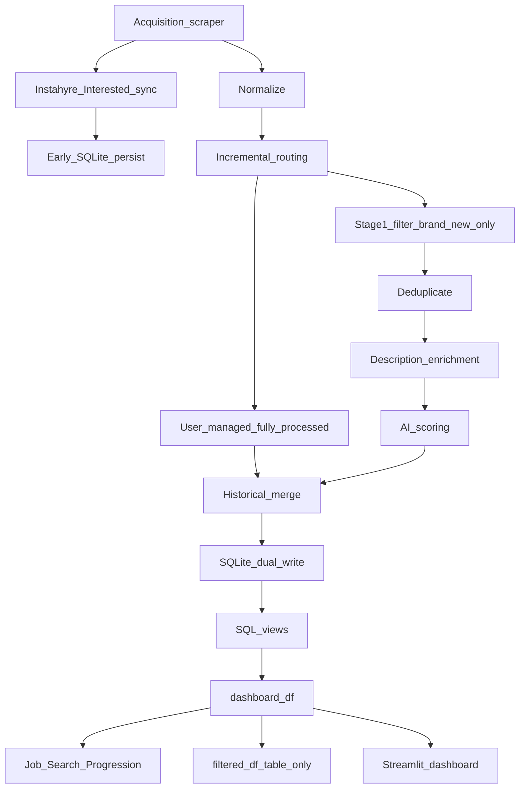

# Repository Map

**File:** `docs/REPOSITORY_MAP.md` — primary structural navigation guide for the codebase.

**Last audited:** 2026-06-12 (Phase 3A.2 UI polish, source display, dynamic panel height)

**Operational snapshot:** [PRODUCT_STATUS_SUMMARY.md](./PRODUCT_STATUS_SUMMARY.md)

---

**Documentation index:** Start at [README.md §Documentation](../README.md#documentation); use this map for code navigation, subsystem ownership, and data flow.

**If you are an AI agent:** Read [PRODUCT_STATUS_SUMMARY.md](./PRODUCT_STATUS_SUMMARY.md) for current posture, then this map for file ownership and data flow before editing pipeline, DB, scraper, or dashboard code.

---

## 1. Executive Summary

### What the product is

A **personal, local-first career intelligence platform**: multi-source job acquisition, layered filtering, AI-assisted fit scoring with explainable reasons, recruiter relationship memory, and a Streamlit decision dashboard. Single operator; not multi-tenant.

### Current maturity

- **SQLite product memory (D0–D8B):** COMPLETE — `data/ai_job_agent.db` is the default operational source of truth.
- **Production scheduler:** COMPLETE — macOS launchd at 10:00 / 21:00 IST via Phase 2.95.
- **Active roadmap phase:** Phase 3 — Prioritization Intelligence (3A Recommended Actions shipped; 3B HM recruiter enrichment shipped; relationship action queues deferred).
- **Unit tests:** 38 modules under `tests/`; contract/invariant coverage remains a roadmap priority.

### Architecture style

- **Local-first monolith:** Python pipeline + Streamlit UI; no hosted API.
- **Stage-based pipeline:** Single orchestrator in `src/agent/main.py` with memory-aware incremental routing before Stage-1, then filter → dedup → enrich → score → persist for brand-new jobs.
- **Read model:** SQL views (`current_jobs_view`, `historical_jobs_view`, `active_recruiters_view`) consumed by dashboard and exports.
- **Write model:** End-of-run dual-write cohort to SQLite; optional CSV export for backup/handoff.

### SQLite as source of truth

| Concern | Authority |
|---------|-----------|
| Job memory, AI evaluations, descriptions, CRM | `data/ai_job_agent.db` |
| Feature flags (D8B defaults) | [`src/db/config.py`](../src/db/config.py) — `sqlite_flag()` |
| CSV files under `data/` | Exports when enabled; not the daily read path under D8B write-primary |
| LinkedIn / Instahyre sessions | `data/*.json` auth files (never in DB) |
| AI candidate identity | [`config/profiles/ai_candidate_profile.example.md`](../config/profiles/ai_candidate_profile.example.md) |

No `SQLITE_*` environment variables are required for normal operation.

### Scheduler architecture

```text
launchd plist (10:00 / 21:00 IST)
  → scripts/scheduling/run_scheduled_acquisition.sh
    → source .env (OPENAI_API_KEY required)
    → export LINKEDIN_MAX_RUNS=3
    → scripts/scheduling/with_file_lock.py (fcntl lock)
      → scripts/scheduling/_acquisition_locked_body.sh
        → python main.py
        → validate_sqlite_parity.py --mode production --fail-on-error
```

Install and configuration detail (plist labels, logs, uninstall): [SCHEDULER_SETUP.md](./SCHEDULER_SETUP.md) (canonical).

### Agent architecture (today vs future)

**Today:** `src/agent/` is a **deterministic pipeline** — not an autonomous agent. Modules are stage-specific (normalize, filter, dedup, score, persist). OpenAI is used only for batch job-fit scoring.

**Future:** Phase 11 (Autonomous Career Copilot) and Phase 14 (Autonomous Application Agent) in [PRODUCT_STATUS_SUMMARY.md](./PRODUCT_STATUS_SUMMARY.md). Likely new packages under `src/` (e.g. integrations, apply automation) — locations TBD.

---

## 2. Top-Level Directory Map

| Folder / file | Purpose | Key files | Notes |
|---------------|---------|-----------|-------|
| [`main.py`](../main.py) | Public pipeline entry shim | `main.py` | `python main.py` → `agent.main` |
| [`src/agent/`](../src/agent/) | Core pipeline logic | `main.py`, `ai_batch_scorer.py`, `job_identity.py`, `historical_persistence.py` | ~1,270-line orchestrator |
| [`src/db/`](../src/db/) | SQLite product memory | `config.py`, `services/dual_write.py`, `models/schema.py`, `read/` | SQLAlchemy + Alembic |
| [`src/paths.py`](../src/paths.py) | Canonical path resolution | `paths.py` | DATA_DIR, DB, config, auth paths |
| [`scraper/`](../scraper/) | Source adapters + orchestrators | `linkedin.py`, `instahyre.py`, `linkedin_query_orchestrator.py`, `acquisition_gate.py` | Playwright + HTTP APIs |
| [`dashboard/`](../dashboard/) | Streamlit operator UI | `app.py`, `loaders.py`, `data_flow.py`, `recommended_actions*.py`, `source_display.py`, `ui_help.py`, `display_text.py`, `funnel.py`, `funnel_workflow.py`, `recruiter_stages.py`, `recruiter_funnel.py`, `recruiter_workflow.py` | Read/write via SQLite views |
| [`scripts/`](../scripts/) | Ops, validation, maintenance | `scheduling/`, `validate_sqlite_parity.py`, `reset_state.sh`, `export_csv_memory.py` | Bash + venv Python |
| [`config/`](../config/) | Non-secret runtime config | `linkedin_queries.json`, `instahyre_feeds.json`, `profiles/` | No API secrets |
| [`docs/`](../docs/) | Canonical documentation | This file, roadmap, ops guides | 11+ markdown files |
| [`tests/`](../tests/) | Unit tests | 38 `test_*.py` modules | `pytest` from repo root |
| [`alembic/`](../alembic/) | DB schema migrations | `versions/001`–`004`, `env.py` | Head: `004_active_recruiters_view` |
| [`archive_scrapers/`](../archive_scrapers/) | Retired scraper code | `mynexthire.py` | Not in active pipeline |
| [`diagrams/`](../diagrams/) | Architecture visuals | `architecture-diagram.png`, `pipeline_flow.png` | See [§2.1 Diagram assets](#21-diagram-assets) |
| [`data/`](../data/) | Runtime state (gitignored) | `ai_job_agent.db`, auth JSON, CSV exports | Created at runtime |
| [`logs/`](../logs/) | Acquisition + debug logs (gitignored) | `scheduled/acquisition-*.log` | Scheduler output |
| [`archive/`](../archive/) | Reset snapshots (gitignored) | `reset-YYYYMMDD-HHMM/` | Created by `archive_state.sh` |
| [`.env`](../.env) | Local secrets (gitignored) | `OPENAI_API_KEY`, optional overrides | Required for scheduled runs |

### 2.1 Diagram assets

| Asset | Status | Used by | Source |
|-------|--------|---------|--------|
| `architecture-diagram.png` | **Current** | README §System Architecture | Eraser (manual export; source of truth) |
| `pipeline_flow.png` | **Current** | README §End-to-End Pipeline Flow | `_generate_pipeline_flow_excalidraw.py` |
| `pipeline_flow.excalidraw` | Source | Regenerate `pipeline_flow.png` | `_generate_pipeline_flow_excalidraw.py` |
| `dashboard-hero.png` | **Current** (2026-06) | README Dashboard — Job Search Progression, KPI row, Last acquisition refresh | Manual Streamlit capture |
| `dashboard-crm.png` | **Pending refresh** | README CRM section | Manual capture: stage column only; no outreach columns |
| `dashboard-recommended-actions.png` | **Pending** | README §Recommended Actions Command Center | Manual capture: four-queue 2×2 grid, Applied ✓, help icon, footer row |
| `dashboard-source-filter.png` | **Pending** | PCR §8 / README § Dashboard | Manual capture: sidebar Source multiselect with human-readable labels |
| `dashboard-source-distribution.png` | **Pending** | README § Dashboard / PCR §8 | Manual capture: Source Distribution chart with normalized labels |
| `dashboard-job-listings-header.png` | **Pending** | README § Phase 3B / PCR §8 HM | Manual capture: Job Listings title with HM enrichment info icon |
| `dashboard-applied-quick-action.png` | **Pending** | OPS §2.8 / PCR §8 | Manual capture: Open Job, Applied ✓, Why? on one action row |
| `dashboard-analytics.png` | **Deprecated** | Retired — Job Search Progression in hero; do not embed stale analytics-only UI | Superseded by hero |
| `architecture-diagram.svg` | **Deprecated** | Not embedded in README | legacy (superseded by Eraser PNG) |
| `architecture-diagram (Old CSV).png` | **Deprecated** | Do not use | legacy |

---

## 3. Critical Entry Points

| Entry point | How to run | Delegates to |
|-------------|------------|--------------|
| Pipeline | `python main.py` | [`src/agent/main.py`](../src/agent/main.py) via [`main.py`](../main.py) shim |
| Dashboard | `streamlit run dashboard/app.py` | [`dashboard/app.py`](../dashboard/app.py) → [`dashboard/loaders.py`](../dashboard/loaders.py) |
| Scheduled acquisition | launchd 10:00 / 21:00 IST | [`run_scheduled_acquisition.sh`](../scripts/scheduling/run_scheduled_acquisition.sh) |
| Install scheduler | `./scripts/scheduling/install_launchagents.sh` | Plist templates in `scripts/scheduling/launchd/` |
| LinkedIn acquisition | Inside pipeline | `run_linkedin_acquisition_session()` in [`linkedin_query_orchestrator.py`](../scraper/linkedin_query_orchestrator.py) |
| Instahyre feed acquisition | Inside pipeline | `run_instahyre_feed_session()` in [`instahyre_feed_orchestrator.py`](../scraper/instahyre_feed_orchestrator.py) |
| Instahyre Interested sync | After feeds when `INSTAHYRE_MAX_RUNS≠0` | `sync_instahyre_interested()` + `persist_instahyre_interested_sync()` |
| DB migrations | `alembic upgrade head` | [`alembic/versions/`](../alembic/versions/) |
| Parity validation | Post-run (automatic) or manual | [`scripts/validate_sqlite_parity.py`](../scripts/validate_sqlite_parity.py) |
| DB init | First-time / recovery | [`scripts/db_init.py`](../scripts/db_init.py) |
| State reset | Operator maintenance | [`scripts/reset_state.sh`](../scripts/reset_state.sh) |

Command detail: [PROJECT_COMMAND_REFERENCE.md](./PROJECT_COMMAND_REFERENCE.md).

---

## 4. Core Product Systems

| System | Purpose | Key files | Depends on | Roadmap phase | Status |
|--------|---------|-----------|------------|---------------|--------|
| **Acquisition** | Multi-source job ingestion | `scraper/*`, orchestrators, `acquisition_gate.py` | Playwright, auth JSON, `config/*.json` | Phase 1, 2.57 | COMPLETE / 2.57 MOSTLY COMPLETE |
| **Normalization** | Unified job dict shape | `src/agent/normalizer.py` | — | Phase 1 (1D) | COMPLETE |
| **Stage-1 filtering** | Cheap PM/location/seniority gate | `src/agent/filter_engine.py` | — | Phase 1 (1C) | COMPLETE |
| **Identity (V2)** | Stable cross-source job keys | `src/agent/job_identity.py`, `src/db/read/historical_index.py` | Historical index | Phase 2.58 | MOSTLY COMPLETE |
| **Deduplication** | URL + fuzzy dedup | `src/agent/dedup_engine.py` | `rapidfuzz` | Phase 1 (1E) | COMPLETE |
| **Incremental routing** | Skip re-work for known jobs | `src/agent/main.py`, `historical_persistence.py` | SQLite pipeline read | Phase 2.6 (2.6E) | MOSTLY COMPLETE |
| **Description enrichment** | Fetch + cache full JD text | `description_fetcher.py`, `job_description_persistence.py` | Playwright, SQLite | Phase 1 (1F) | COMPLETE |
| **AI scoring** | Batch OpenAI fit evaluation | `ai_batch_scorer.py`, `profile_loader.py`, `config/profiles/` | OpenAI API, `.env` | Phase 2, 2.59 | COMPLETE |
| **Historical memory** | Cross-run job retention | `historical_persistence.py`, SQLite `jobs`, `job_observations` | Dual-write | Phase 2.6 | MOSTLY COMPLETE |
| **SQLite product memory** | Authoritative persistence + views | `src/db/*`, Alembic migrations | SQLAlchemy | Phase 2.55 | COMPLETE |
| **CRM** | Recruiter discovery + relationship fields | `recruiter_crm.py`, `recruiters` table, dashboard CRM UI | Dual-write | Phase 2.8 | COMPLETE (v1) |
| **Dashboard** | Operator jobs + CRM UI | `dashboard/app.py`, `loaders.py`, `dashboard_write.py` | SQLite views | Phase 2.7 | COMPLETE |
| **Recommended Actions (3A / 3A.2)** | Job-centric four-queue Command Center (waterfall) | `recommended_actions.py`, `recommended_actions_ui.py`, `recommended_actions_config.py`, `display_text.py`, `source_display.py`, `ui_help.py` | `dashboard_df` | Phase 3A | COMPLETE |
| **HM recruiter enrichment (3B)** | Job Listings HM edit → recruiter CRM | `recruiter_enrichment.py`, `dashboard_write.py`, `job_editor.py`, `app.py` | SQLite `jobs`, `recruiters`, `recruiter_job_links` | Phase 3B | COMPLETE |
| **Job Search Progression** | Snapshot stage cards (Discovery / Application / Outcomes) | `funnel.py`, `funnel_workflow.py`, `app.py` | `dashboard_df` | Phase 2.7C | COMPLETE |
| **Recruiter Relationship Progression** | CRM stage cards by `recruiter_stage` | `recruiter_funnel.py`, `recruiter_workflow.py`, `recruiter_stages.py` | `recruiter_crm_df` | Phase 2.8 | COMPLETE |
| **Analytics (v1)** | Pipeline counts, source rates, CRM counters | `dashboard/app.py` — **Pipeline analytics** expander | `dashboard_editor_df` | Phase 2.7C, 5 | 2.7C COMPLETE; Phase 5 PARTIAL |
| **Instahyre Interested sync** | Applied-state sync from Interested filter | `instahyre.py`, `dual_write.persist_instahyre_interested_sync` | Early SQLite write | Phase 2.57 | COMPLETE |
| **User-managed routing** | CRM stages skip AI (`not_required`) | `pipeline_stages.py`, `main.py` routing | SQLite pipeline read | Phase 2.6+ | COMPLETE |
| **Scheduler** | Unattended acquisition + parity | `scripts/scheduling/*` | launchd, `.env` | Phase 2.95 | COMPLETE |
| **Validation / parity** | Post-run DB health checks | `validate_sqlite_parity.py`, `parity_checks.py` | SQLite | Phase 2.56 | COMPLETE |
| **Pipeline hardening** | Shared architecture, runtime stability | `src/agent/main.py`, `scraper/linkedin.py` | — | Phase 2.5 | MOSTLY COMPLETE |
| **Prioritization (3A)** | Job action queues (rule-based) | `recommended_actions.py`, `recommended_actions_ui.py` | `dashboard_df` | Phase 3A | COMPLETE |
| **HM recruiter enrichment (3B)** | Dashboard HM → recruiters + append-only links | `recruiter_enrichment.py` | `dashboard_write.py` | Phase 3B | COMPLETE |
| **Recruiter relationship queues (3B+)** | Relationship action queues | *(deferred)* | CRM touch timestamps, notes UI | Phase 3B+ | FUTURE |
| **Prioritization (3C+)** | Signal-weighted ranking, ML | *(not implemented)* | Phase 3 prerequisites | Phase 3 | FUTURE |
| **Decision intelligence** | Career strategy recommendations | *(not implemented)* | Phase 3 | Phase 4 | FUTURE |
| **Advanced analytics** | Trends, patterns, SQL analytics views | *(partial dashboard metrics only)* | `job_observations` | Phase 5 | PARTIAL |
| **Multi-source expansion** | Net-new job boards | *(Wellfound, YC pending; RemoteOK deferred)* | Pipeline gates (6B) | Phase 6 | PARTIAL |
| **Conversion automation** | Resume, apply, outreach, reminders | *(not implemented)* | Phases 7A–7D | Phase 7 | FUTURE |
| **Behavioral learning** | Personalized recommendations | *(not implemented)* | Historical memory | Phase 8 | FUTURE |
| **Frontend evolution** | PM-grade UX beyond Streamlit | Streamlit baseline only | — | Phase 9 | FUTURE (baseline COMPLETE) |
| **Extended automation** | Failure alerts, digests | Scheduler only; alerts not built | Phase 2.95 | Phase 10 | FUTURE |
| **Autonomous copilot** | End-to-end orchestration | *(not implemented)* | Phases 3, 7, 13 | Phase 11 | FUTURE |
| **Productionization** | Cloud, multi-user, APIs | Local SQLite only | — | Phase 12 | PARTIAL |
| **Integrations ecosystem** | Calendar, Gmail, MCP, Slack | *(not implemented)* | — | Phase 13 | FUTURE |
| **Autonomous application** | End-to-end apply execution | *(not implemented)* | Phases 7B, 13 | Phase 14 | FUTURE |

Phase detail: [PRODUCT_STATUS_SUMMARY.md](./PRODUCT_STATUS_SUMMARY.md) §8–§9.

---

## 5. Data Flow

### Primary pipeline flow

```text
Scrapers (LinkedIn, Instahyre feeds, Greenhouse, Lever, WeWorkRemotely)
  → [Instahyre only] Interested sync (list-only) → early SQLite persist (not in all_jobs)
  → normalize (normalizer.py)
  → incremental routing (historical lookup in main.py)
  → user-managed historical stage → fully_processed + not_required (skip Stage-1 / dedup / fetch / AI)
  → brand-new: Stage-1 filter → deduplicate → description fetch on miss → AI batch score
  → needs-AI-only: join AI queue (skip Stage-1 / dedup / fetch)
  → fully-processed: materialize from historical memory (skip Stage-1 / dedup / fetch / AI)
  → historical merge (historical_persistence.py)
  → dual-write SQLite (dual_write.py)
  → optional jobs.csv export
  → dashboard: historical_jobs_view → dashboard_df (visibility) / filtered_df (sidebar → table)
  → Recommended Actions (four-queue waterfall on dashboard_df) + Job Search Progression + Source Distribution + Pipeline analytics in Streamlit
```

Routing logic: `main.py` (~L789–848). User-managed stages: `pipeline_stages.py`.

**Routing cohorts:**

- **Brand new** → Stage-1 → dedup → descriptions → AI queue
- **Needs AI only** → joins AI queue directly (historical row already passed prior pipeline)
- **User-managed historical** → fully_processed + `not_required` (CRM stages; skip AI)
- **Fully processed** → merged from historical memory without re-scoring



### Secondary flows

| Flow | Path |
|------|------|
| **Dashboard write-back** | User edits → `dashboard_write.py` → `user_job_state` / `recruiters`; HM change → `recruiter_enrichment.py` (append-only links) |
| **Scheduler post-run** | `_acquisition_locked_body.sh` → parity validation → exit code to launchd |
| **Reset / archive** | `archive_state.sh` → `reset_state.sh` → truncate DB + seed from templates |
| **CSV export / handoff** | `export_csv_memory.py` → `data/*.csv` |
| **CRM discovery** | Pipeline → `recruiter_crm.py` → dual-write recruiters + job links |
| **Interested sync** | `sync_instahyre_interested()` → `persist_instahyre_interested_sync()` → jobs, observations, `not_required` evals |
| **Dashboard cohort split** | `data_flow.build_dashboard_df()` → viz; `apply_sidebar_filters()` → Job Listings only |

Visual: [diagrams/architecture-diagram.png](../diagrams/architecture-diagram.png), [diagrams/pipeline_flow.png](../diagrams/pipeline_flow.png).

Depth: [SQLITE_PRODUCT_MEMORY_ARCHITECTURE.md](./SQLITE_PRODUCT_MEMORY_ARCHITECTURE.md).

---

## 6. Configuration and Runtime Files

| Location | Contents | Sensitive? |
|----------|----------|------------|
| `config/linkedin_queries.json` | LinkedIn query catalog, cooldowns, anchor/follow-up | No |
| `config/instahyre_feeds.json` | Instahyre feed definitions | No |
| `config/profiles/ai_candidate_profile.example.md` | AI scoring candidate identity | Personal; not an API key |
| `config/profiles/README.md` | Profile editing guide | No |
| `data/ai_job_agent.db` | SQLite product memory | Local data |
| `data/linkedin_auth.json` | LinkedIn Playwright session | Yes — gitignored |
| `data/instahyre_auth.json` | Instahyre Playwright session | Yes — gitignored |
| `data/.linkedin_query_state.json` | Query cooldown mirror | Operational state |
| `.env` | `OPENAI_API_KEY`, optional path/flag overrides | Yes — gitignored |
| `src/db/config.py` | D8B feature-flag defaults | No |

Path resolution: [`src/paths.py`](../src/paths.py).  
Flags reference: [PROJECT_COMMAND_REFERENCE.md §10b](./PROJECT_COMMAND_REFERENCE.md#sqlite-product-memory-source-of-truth).

---

## 7. `src/agent/` Module Index

| Module | Responsibility |
|--------|----------------|
| `main.py` | Pipeline orchestration (all stages) |
| `pipeline_stages.py` | Discovery vs user-managed stage constants (shared with dashboard) |
| `normalizer.py` | Job dict normalization |
| `filter_engine.py` | Stage-1 PM/location/seniority filter |
| `dedup_engine.py` | URL + fuzzy deduplication |
| `job_identity.py` | JOB_KEY_V2, identity metrics and funnels |
| `historical_persistence.py` | Historical index load/merge, `times_seen` |
| `job_description_persistence.py` | Description cache (SQLite + legacy CSV path) |
| `description_fetcher.py` | Playwright job-description fetch |
| `ai_batch_scorer.py` | OpenAI batch scoring |
| `profile_loader.py` | Candidate profile markdown loader |
| `ai_runtime_config.py` | `BATCH_SIZE`, `DEBUG_LIMIT` resolution |
| `recruiter_crm.py` | Recruiter discovery + CRM field sync |
| `logger.py` | Stage-1 structured debug logging |
| `bootstrap_schema.py` | Legacy CSV schema helpers |

---

## 8. `src/db/` Layer Index

| Area | Key files | Role |
|------|-----------|------|
| Flags | `config.py` | D8B default-on `sqlite_flag()` gates |
| Schema | `models/schema.py` | ORM tables: jobs, runs, observations, evaluations, recruiters, user_job_state, cooldown |
| Read | `read/views.py`, `historical.py`, `crm.py`, `historical_index.py`, `export_cohort.py` | Views + pipeline/dashboard reads |
| Write | `services/dual_write.py`, `services/dashboard_write.py` | Cohort write; dashboard edits |
| Validation | `services/parity_checks.py` | Parity modes for `validate_sqlite_parity.py` |
| Bootstrap | `bootstrap.py`, `reset_sqlite.py` | DB readiness and reset helpers |

Alembic migrations: `001_mvp_schema` → `002_read_views` → `003_query_metadata` → `004_active_recruiters_view`.

---

## 9. `scraper/` Source Index

| Source | Module | Orchestrator / config |
|--------|--------|----------------------|
| LinkedIn | `linkedin.py` | `linkedin_query_orchestrator.py` + `config/linkedin_queries.json` |
| Instahyre | `instahyre.py` | `instahyre_feed_orchestrator.py` + `config/instahyre_feeds.json` |
| Greenhouse | `greenhouse.py` | `company_sources.py` |
| Lever | `lever.py` | `company_sources.py` |
| WeWorkRemotely | `weworkremotely.py` | Direct scrape |
| Shared gating | `acquisition_gate.py` | `*_MAX_RUNS` env resolution |
| Archived | `archive_scrapers/mynexthire.py` | SUPERSEDED — not in pipeline |

---

## 10. Documentation Map

| Document | Audience | Purpose |
|----------|----------|---------|
| [README.md](../README.md) | All | Primary documentation index and product narrative |
| [PRODUCT_STATUS_SUMMARY.md](./PRODUCT_STATUS_SUMMARY.md) | Onboarding, operator | Temporal status snapshot, capability maturity, limitations |
| **REPOSITORY_MAP.md** (this file) | Dev, agent, operator | Structure, ownership, navigation |
| [PRODUCT_STATUS_SUMMARY.md](./PRODUCT_STATUS_SUMMARY.md) | Planning | Phase statuses, evidence, priorities |
| [PRODUCTION_OPERATIONS.md](./PRODUCTION_OPERATIONS.md) | Operator | Daily runbook, pre-production reset |
| [PROJECT_COMMAND_REFERENCE.md](./PROJECT_COMMAND_REFERENCE.md) | Operator, dev | Commands, flags, troubleshooting |
| [SCHEDULER_SETUP.md](./SCHEDULER_SETUP.md) | Operator | launchd install, schedule, logs |
| [SQLITE_PRODUCT_MEMORY_ARCHITECTURE.md](./SQLITE_PRODUCT_MEMORY_ARCHITECTURE.md) | Architect, dev | Data model depth, memory philosophy |
| [SQLITE_IMPLEMENTATION_PLAN.md](./SQLITE_IMPLEMENTATION_PLAN.md) | Migration history | D0–D8B timeline, rollback reference |
| [PUBLIC_REPO.md](./PUBLIC_REPO.md) | Maintainer | Sanitized mirror checklist |
| [config/profiles/README.md](../config/profiles/README.md) | Operator | AI candidate profile editing |

---

## 11. Operational Scripts Index

Full command syntax: [PROJECT_COMMAND_REFERENCE.md §10](./PROJECT_COMMAND_REFERENCE.md#10-helper-scripts-scripts).

### Scheduling

| Script | Role |
|--------|------|
| `scripts/scheduling/run_scheduled_acquisition.sh` | launchd entry: env, lock, log, invoke pipeline + parity |
| `scripts/scheduling/_acquisition_locked_body.sh` | Locked body: `main.py` + production parity |
| `scripts/scheduling/with_file_lock.py` | fcntl file lock wrapper |
| `scripts/scheduling/run_scheduled_backup.sh` | Optional weekly backup (Sunday 23:00) |
| `scripts/scheduling/install_launchagents.sh` | Install/uninstall launchd plists |
| `scripts/scheduling/launchd/*.plist.template` | launchd schedule templates |

### Validation

| Script | Role |
|--------|------|
| `scripts/validate_sqlite_parity.py` | Production / SOT / import parity modes |
| `scripts/validate_bootstrap.py` | Post-reset bootstrap checks |
| `scripts/validate_dual_write_parity.py` | Legacy dual-write parity |
| `scripts/shadow_read_parity.py` | CSV vs view shadow reads |

### State management

| Script | Role |
|--------|------|
| `scripts/reset_state.sh` | Operator reset (DB + CSV workspace) |
| `scripts/archive_state.sh` | Snapshot before reset |
| `scripts/export_csv_memory.py` | DB → CSV export for backup/handoff |
| `scripts/import_csv_memory.py` | CSV → DB import (non-destructive) |
| `scripts/reset_runtime.py` | Runtime file cleanup helper |

### Maintenance

| Script | Role |
|--------|------|
| `scripts/db_init.py` | Initialize / upgrade SQLite schema |
| `scripts/cleanup_sqlite_orphan_job.py` | Remove orphan job rows by identity |
| `scripts/migrate_identity_descriptions.py` | Identity/description migration helper |
| `scripts/backfill_observation_query_runs.py` | Backfill observation metadata |
| `scripts/identity_inventory.py` | Identity diagnostics |

### Debug / probes

| Script | Role |
|--------|------|
| `scripts/instahyre_dom_probe.py` | Instahyre DOM debugging |
| `scripts/archive_state.py` | Archive helper (Python) |

---

## 12. Tests Index

38 modules under `tests/`. Run: `pytest` from repository root (venv active).

| Area | Test modules |
|------|--------------|
| AI scoring | `test_ai_batch_scorer.py`, `test_ai_batch_normalization.py`, `test_ai_runtime_config.py`, `test_profile_loader.py` |
| Pipeline / persistence | `test_historical_persistence.py`, `test_job_description_persistence.py`, `test_pipeline_read.py`, `test_bootstrap_guard.py`, `test_pipeline_user_managed_routing.py`, `test_materialize_applied_merge.py` |
| SQLite / DB | `test_db_read_views.py`, `test_d2_export.py`, `test_dual_write_metadata.py`, `test_dual_write_applied_merge.py`, `test_reset_sqlite.py`, `test_sqlite_flag_defaults.py`, `test_sqlite_orphan_cleanup.py`, `test_write_primary.py` |
| Dashboard | `test_dashboard_loaders.py`, `test_dashboard_refresh_label.py`, `test_dashboard_visibility.py`, `test_dashboard_data_flow.py`, `test_dashboard_funnel.py`, `test_dashboard_funnel_workflow.py`, `test_dashboard_recruiter_funnel.py`, `test_dashboard_recruiter_workflow.py`, `test_recommended_actions.py`, `test_recommended_actions_applied.py`, `test_display_text.py`, `test_source_display.py`, `test_dashboard_job_hiring_manager.py`, `test_recruiter_enrichment.py` |
| Validation | `test_validation_modes.py` |
| Scraper / Instahyre | `test_instahyre_discovery.py`, `test_instahyre_interested_sync.py`, `test_instahyre_applied_status.py`, `test_linkedin_anchor_url.py` |
| Scheduling | `test_with_file_lock.py` |

**Gap (roadmap priority):** Contract/invariant tests for Stage-1, dedup, and identity rules are not yet comprehensive.

---

## 13. Future Expansion Areas

| Roadmap phase | Likely future location | Notes |
|---------------|------------------------|-------|
| Phase 3A / 3A.2 Recommended Actions | `dashboard/recommended_actions*.py`, `display_text.py`, `source_display.py`, `ui_help.py` | **Shipped** — four-queue waterfall Command Center (High Confidence, Apply Today, Apply This Week, Needs Review); Applied ✓ on apply queues |
| Phase 3B HM enrichment | `src/db/services/recruiter_enrichment.py` | **Shipped** — Job Listings HM edit; append-only links |
| Phase 3B+ relationship queues | `dashboard/` (future module) | Dormant/warm/health action queues — deferred |
| Phase 3C+ Prioritization | `src/agent/` + `dashboard/app.py` | Signal weighting, ML — future |
| Phase 5 Advanced analytics | `src/db/read/` views + dashboard | `source_effectiveness_view`, time-series |
| Phase 6 Net-new sources | `scraper/` + `config/` | Wellfound, YC; RemoteOK deferred |
| Phase 7 Conversion automation | `src/agent/` (new modules) | Resume, apply assist, outreach, reminders |
| Phase 13 Integrations | `src/integrations/` or similar (TBD) | Calendar, Gmail, MCP, Slack |
| Phase 14 Autonomous application | `scraper/` or dedicated package (TBD) | Playwright apply flows, safeguards |

Canonical phase detail: [PRODUCT_STATUS_SUMMARY.md](./PRODUCT_STATUS_SUMMARY.md) §9.

---

*End of repository map. For daily operations see [PRODUCTION_OPERATIONS.md](./PRODUCTION_OPERATIONS.md). For commands see [PROJECT_COMMAND_REFERENCE.md](./PROJECT_COMMAND_REFERENCE.md).*
